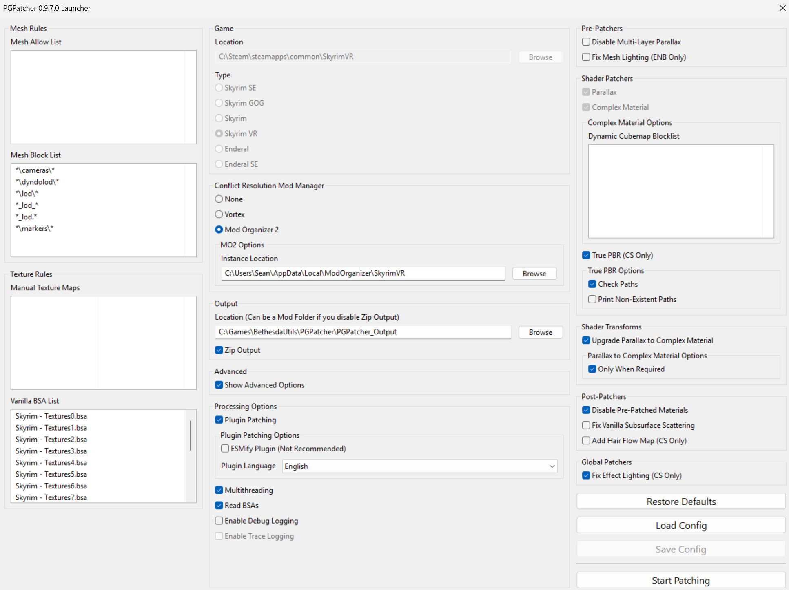
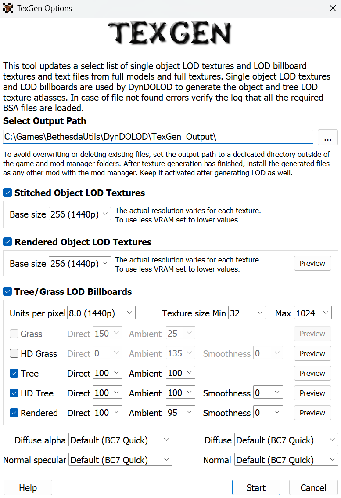
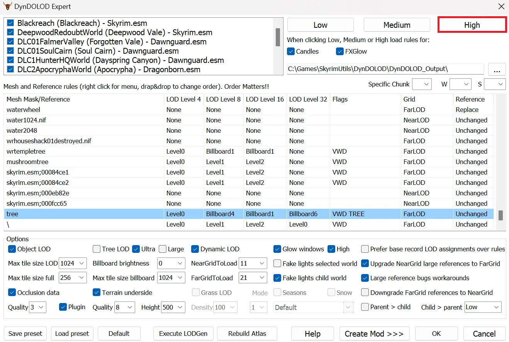

[Change Log](https://github.com/pluto-skyrimvr/pluto-skyrimvr.github.io/commits/main/)

# Introduction
The modlist follows the actual load order of the mods. i.e. the files of the mods in the top will be overwritten by the files of the mods that are placed below. Consider it as how mods are placed in the left panel of the Mod Organizer 2. The plugin(esp files) load order should be sorted by LOOT(Sort button in Mod Organizer 2).

# Modding Tools
## Mod Organizer
[Mod Organizer 2](https://www.nexusmods.com/skyrimspecialedition/mods/6194): De facto standard for any large modlists.

## Mod Organizer 2 Plugins
[Root Builder](https://www.nexusmods.com/skyrimspecialedition/mods/31720): To keep the original Skyrim VR directory clean, you should start using Root Builder.\
[NIF Preview](https://www.nexusmods.com/skyrimspecialedition/mods/69813): (Optional) You can compare the differnce between 3D meshes easily.\
[NIF Preview DLL Fix](https://github.com/aglowinthefield/modorganizer-preview_nif/releases): The original DLL from NIF Preview is outdated and does not work with the latest Mod Organizer 2. Download preview_nif.dll.\
[Bethesda Plugin Manager for Mod Organizer](https://www.nexusmods.com/skyrimspecialedition/mods/111236): (Optional) You can see the plugin record conflicts easily.\
[Bethesda Plugin Manager for Mod Organizer DLL Fix](https://www.mediafire.com/file/mi811ntoaswxb1f/bsplugins.dll/file): The original DLL is outdated and does not work with the latest Mod Organizer 2.

# Mod List

## OpenComposite
[Skyrim VR OpenComposite Fixes Custom Build](https://www.nexusmods.com/skyrimspecialedition/mods/85389): (Optional) It improves performance for the OpenXR devices such as Meta Quest by skipping SteamVR(OpenVR) layer. Download the Main. Use Root builder. A downside is that you cannot name your character in game because it does not have VR keyboard. You will have to use its INI if you have to name your character. I do not mind personally.

## Core
[SKSE VR](https://skse.silverlock.org/)\
[Unofficial High Definition Audio Project](https://www.nexusmods.com/skyrimspecialedition/mods/18115): Improves vanilla audio quality greatly including voices.\
[Unofficial Skyrim Special Edition Patch](https://www.nexusmods.com/skyrimspecialedition/mods/266?tab=files&file_id=209150): Download v4.2.5b (pre-AE version).\
[Skyrim VR USSEP patch for USSEP 4.2.5b](https://www.nexusmods.com/skyrimspecialedition/mods/91475)\
[SkyUI VR](https://www.nexusmods.com/skyrimspecialedition/mods/91535)\
[SkyUI VR - Disable New Item Sort](https://www.nexusmods.com/skyrimspecialedition/mods/110564)\
[Engine Fixes VR](https://www.nexusmods.com/skyrimspecialedition/mods/62089): Download both Main files. Use Root Builder for Part 2.\
[Skyrim VR ESL Support](https://www.nexusmods.com/skyrimspecialedition/mods/106712): Download Main, PapyrusUtil ESL Patch, RaceMenu ESL Patch.\
[Skyrim Project Optimization SE](https://www.nexusmods.com/skyrimspecialedition/mods/14084): Download ESL version not because it is ESL but because it has USSEP changes.\
[eFPS - Exterior FPS boost](https://www.nexusmods.com/skyrimspecialedition/mods/54907)

## New Contents
[Alternate Start - Live Another Life - SSE](https://www.nexusmods.com/skyrimspecialedition/mods/272?tab=files&file_id=175926): Download 4.1.4 (pre-AE version). You must extract BSA when you install the mod. Also, you have to disable VR playroom in SkyrimVR INI to make the mod work.\
[Alternate Start Voiced](https://www.nexusmods.com/skyrimspecialedition/mods/66541)\
[Missives](https://www.nexusmods.com/skyrimspecialedition/mods/17576): Radiant quests in job boards.\
[Missives - Worldspace Additions](https://www.nexusmods.com/skyrimspecialedition/mods/26788): Download Solstheim patch.\
[Missives - Carriage and Ferry Travel Overhaul Patch](https://www.nexusmods.com/skyrimspecialedition/mods/44498)\
[Missives - Notes Retexture](https://www.nexusmods.com/skyrimspecialedition/mods/46201): Download the main file and Solstheim addition.\
[Missives VR Fix Guide](https://www.nexusmods.com/skyrimspecialedition/mods/32507): Follow the guide to fix UI issue. It's a simple INI tweak.\
[The Forgotten City](https://www.nexusmods.com/skyrimspecialedition/mods/1179): (Optional) I normally stick to the vanilla contents but this one is too good to skip.

## Survival
[Dynamic Campsites](https://www.nexusmods.com/skyrimspecialedition/mods/106932)\
[Dynamic Campsites - 2K Retexture](https://www.nexusmods.com/skyrimspecialedition/mods/136009)\
[Dynamic Campsites - Blackreach Addon](https://www.nexusmods.com/skyrimspecialedition/mods/123707): Download ESPFE version.\
[SunHelm Survival and needs](https://www.nexusmods.com/skyrimspecialedition/mods/39414): Choose Diseases, SkyrimVR in the installer.\
[Nordic UI Icons for Sunhelm and iNeed Widgets](https://www.nexusmods.com/skyrimspecialedition/mods/61823): Choose SunHelm, no for widget addon in the installer. This mod is a workaround to fix SunHelm's cold widget glitch that messes with SkyUI VR.\
[You Hunger SE](https://www.nexusmods.com/skyrimspecialedition/mods/9143)

## Adult Contents
[OStim Standalone - Advanced Adult Animation Framework](https://www.nexusmods.com/skyrimspecialedition/mods/98163)\
[OStim Standalone VR](https://www.nexusmods.com/skyrimspecialedition/mods/119892): Update Racemenu mod's SKSE/Plugins/skeevr.ini to set "bEnableOverlays=0" in order to fix disappearing NPC issue.\
[OStim Community Resource](https://www.nexusmods.com/skyrimspecialedition/mods/106519): Choose 3BA in the installer.\
[OCum Ascended - Cum and Orgasm Mechanics for OStim](https://www.nexusmods.com/skyrimspecialedition/mods/77506): Don't install UBE patch.\
[OStim NPCs](https://www.nexusmods.com/skyrimspecialedition/mods/82888)\
[OSmp - Automatic SMP physics toggle for OStim](https://www.nexusmods.com/skyrimspecialedition/mods/72547)\
[Female Moan Voicesets For Ostim Standalone](https://www.nexusmods.com/skyrimspecialedition/mods/121383)\
[Amorous Adventures for Ostim](https://www.nexusmods.com/skyrimspecialedition/mods/48912)\
[Amorous Adventures for OStim Standalone - Patch and Fixes](https://www.nexusmods.com/skyrimspecialedition/mods/69248)\
[Amorous Adventures for Ostim - Script Fix](https://www.nexusmods.com/skyrimspecialedition/mods/90570)\
[Amorous Adventures OStim Standalone - OStim Sequences](https://www.nexusmods.com/skyrimspecialedition/mods/106773): Download the Main and Vampire Fix.\
[Amorous Adventures Revoiced Complete](https://www.nexusmods.com/skyrimspecialedition/mods/127289)

## Adult Animations
[Open Animations Romance and Erotica for OStim Standalone](https://www.nexusmods.com/skyrimspecialedition/mods/98732): Choose Keep OStim default icons in the installer.\
[Open Animations 3P Plus for OStim Standalone](https://www.nexusmods.com/skyrimspecialedition/mods/116829)\
[OStim SA Official Icon Patch for OARE and OA3PP](https://www.nexusmods.com/skyrimspecialedition/mods/106384): Download both Main files.\
[Lovemaking Compendium for OStim Standalone](https://www.nexusmods.com/skyrimspecialedition/mods/98271)\
[Night-blooming Violets for OStim Standalone](https://www.nexusmods.com/skyrimspecialedition/mods/98276)\
[Billyy's animations for Ostim Standalone](https://www.nexusmods.com/skyrimspecialedition/mods/102778): Choose every module, Adapted furniture in the installer.\
[Billyy Wall Pack for OStim Standalone](https://www.nexusmods.com/skyrimspecialedition/mods/101838)\
[Billyy Table Pack for OStim Standalone](https://www.nexusmods.com/skyrimspecialedition/mods/99907)\
[Billyy Chair and Bench Pack for OStim Standalone](https://www.nexusmods.com/skyrimspecialedition/mods/98803)\
[Leito's animations for Ostim Standalone](https://www.nexusmods.com/skyrimspecialedition/mods/104775): Choose every module, Adapted furniture in the installer.\
[Nibbles' animations for Ostim Standalone](https://www.nexusmods.com/skyrimspecialedition/mods/102528): Choose every module, Adapted furniture in the installer.\
[Anub's animations for Ostim Standalone](https://www.nexusmods.com/skyrimspecialedition/mods/101918): Choose every module, Adapted furniture, all face expressions in the installer.\
[BakaFactory's Animations for Ostim Standalone](https://www.nexusmods.com/skyrimspecialedition/mods/106473)\
[Milky's Animations for Ostim Standalone](https://www.nexusmods.com/skyrimspecialedition/mods/106875)

## Libraries and Utilities
[VR Address Library for SKSEVR](https://www.nexusmods.com/skyrimspecialedition/mods/58101)\
[Spell Perk Item Distributor (SPID) VR](https://www.nexusmods.com/skyrimspecialedition/mods/59121)\
[Keyword Item Distributor (KID)](https://www.nexusmods.com/skyrimspecialedition/mods/55728)\
[FormList Manipulator - FLM](https://www.nexusmods.com/skyrimspecialedition/mods/74037)\
[PapyrusUtil SE - Modders Scripting Utility Functions](https://www.nexusmods.com/skyrimspecialedition/mods/13048): Download VR version.\
[powerofthree's Papyrus Extender](https://www.nexusmods.com/skyrimspecialedition/mods/22854): Choose SSE v1.5.97("Special Edition") in the installer. The DLL will be replaced by the VR version below.\
[Papyrus Extender VR](https://www.nexusmods.com/skyrimspecialedition/mods/58296)\
[Papyrus Tweaks NG](https://www.nexusmods.com/skyrimspecialedition/mods/77779)\
[Andrealphus' Papyrus Functions](https://www.nexusmods.com/skyrimspecialedition/mods/85252): This is a requirement for Dragon War.\
[Mfg Fix NG](https://www.nexusmods.com/skyrimspecialedition/mods/133568)\
[ConsoleUtilSSE NG](https://www.nexusmods.com/skyrimspecialedition/mods/76649)\
[Crash Logger VR](https://www.nexusmods.com/skyrimspecialedition/mods/59818): Download Main and VR PDB.\
[JContainers SE](https://www.nexusmods.com/skyrimspecialedition/mods/16495): Download VR version.\
[Save Unbaker VR](https://www.nexusmods.com/skyrimspecialedition/mods/86265)\
[UIExtensions](https://www.nexusmods.com/skyrimspecialedition/mods/17561): This mod is a soft requirement for many mods. Modders often forget to mention it because not having it doesn't break critical things.\
[RaceMenu](https://www.nexusmods.com/skyrimspecialedition/mods/19080): This mod's overlay functions are soft requirement for other mods even if you are not interested in customizing your character. Download Main and VR. Delete SKSE directory of the Main mod to delete skee64.dll and skee64.ini.\
[SkyPatcher](https://www.nexusmods.com/skyrimspecialedition/mods/106659): Download VR version.\
[FSMP - Faster HDT-SMP](https://www.nexusmods.com/skyrimspecialedition/mods/57339): Download Main. Do not download XML VR which is not for 3BA body. For my system, I choose VR, NOT CUDA, AVX, No MCM - Extreme performance in the installer. The best options depend on your CPU type. Read this [wiki](https://en.wikipedia.org/wiki/Advanced_Vector_Extensions#CPUs_with_AVX) and decide it for yourself.\
[MCM Helper](https://www.nexusmods.com/skyrimspecialedition/mods/53000): Choose VR, ESL, BSA in the installer.

## Skyrim Particle Patch
[Particle Patch](https://www.nexusmods.com/skyrimspecialedition/mods/65720): Download the Main. Choose Loose files, Particle Patch, No for Light Shafts, Remove for Fake Light Glow and Yes for Custom textures in the installer.

## Weather
[Azurite Weathers](https://www.nexusmods.com/skyrimspecialedition/mods/42731): Download Azurite Weathers II in the Main and Darker nights in the optional files.\
[Obsidian Mountain Fogs Tweaked](https://www.nexusmods.com/skyrimspecialedition/mods/71189): Download default version.

## ReShade
[ReShade Effect Toggler](https://www.nexusmods.com/skyrimspecialedition/mods/98879): (Optional) A minor convenience feature mod. You can only use this for Reshade 5.9+ which is incompatible with OpenComposite.\
[Glamur Reshade VR](https://www.nexusmods.com/skyrimspecialedition/mods/61434): (Optional) Use Root Builder. This Reshade preset is for Fake Global Illumination feature. You can also enable CAS sharpener if you like extra sharpness. Since it uses an old version of Reshade, it works well with OpenComposite. One downside is that it creates strange visual artifacts around transparent meshes such as hairs and bushes.

## DynDOLOD
[DynDOLOD Resources SE 3](https://www.nexusmods.com/skyrimspecialedition/mods/52897): Choose everything only in Visual Options in the installer.\
[DynDOLOD DLL NG](https://www.nexusmods.com/skyrimspecialedition/mods/97720): Choose VR compatible version in the installer.

## Texture and Mesh (Base)
[Base Coat](https://www.nexusmods.com/skyrimspecialedition/mods/46850): Download "Basecoat - Textures only" 1.0 in Old Files section.\
[Static Mesh Improvement Mod](https://www.nexusmods.com/skyrimspecialedition/mods/659): Install Lite version.\
[Static Mesh improvement Mod - SMIM - Quality Addon](https://www.nexusmods.com/skyrimspecialedition/mods/44388)\
[Unofficial Material Fix](https://www.nexusmods.com/skyrimspecialedition/mods/21027)\
[Assorted mesh fixes](https://www.nexusmods.com/skyrimspecialedition/mods/32117): Download the Main.\
[Skyrim Landscape and Water Fixes](https://www.nexusmods.com/skyrimspecialedition/mods/26138): Choose 1.5.97 esm and USSEP, Walkway Wall Fix SMIM, Navigator(ESPFE), Landscape Fixes For Grass Mods in the installer.

## Texture and Mesh (Clutter)
[Ruins Clutter Improved](https://www.nexusmods.com/skyrimspecialedition/mods/5870): Download the latest 3.2c version.\
[Ruins Clutter Improved - Fixes](https://www.nexusmods.com/skyrimspecialedition/mods/21031)\
[Forgotten Retex Project](https://www.nexusmods.com/skyrimspecialedition/mods/7849)\
[Misc Retexture Project](https://www.nexusmods.com/skyrimspecialedition/mods/13578): Download the main file, Retextured SMIM ingredients.\
[RUGNAROK - Special Edition](https://www.nexusmods.com/skyrimspecialedition/mods/5436)

## Texture and Mesh (Armor and Clothing)
[Armor Mesh Fixes SE](https://www.nexusmods.com/skyrimspecialedition/mods/39704): Download the main file only.\
[Cathedral - Armory](https://www.nexusmods.com/skyrimspecialedition/mods/20199): The best quality mesh and texture for armors and weapons. Download the Main, Armor Mesh Fixes SE patch.\
[True HD Nightingale](https://www.nexusmods.com/skyrimspecialedition/mods/4745): The Nightingale armor is not covered by Cathedral Armory. Choose "No" for Sword Retexture in the installer.\
[RUSTIC CLOTHING - Special Edition](https://www.nexusmods.com/skyrimspecialedition/mods/4703): The best looking clothing texture mod.

## Texture and Mesh (Misc)
[Book Covers Skyrim](https://www.nexusmods.com/skyrimspecialedition/mods/901)\
[CC's HQ Roadsigns SSE](https://www.nexusmods.com/skyrimspecialedition/mods/2778): Download HD.\
[SD's Farmhouse Fences SE](https://www.nexusmods.com/skyrimspecialedition/mods/38912): Download 2k Farmhouse Fences SE Version 2.\
[LeanWolf's Better-Shaped Talos Statue with Greatsword SE](https://www.nexusmods.com/skyrimspecialedition/mods/4752): Talos statue looks awkward without this mod.\
[RUSTIC WINDOWS - Special Edition](https://www.nexusmods.com/skyrimspecialedition/mods/1937)\
[Gemling Queen Jewelry SE](https://www.nexusmods.com/skyrimspecialedition/mods/4294): Install everything. Amulet texture 512, Ring texture combined 1K recommended. Delete esp file. It's not needed because the fix is included in USSEP.\
[Circlet USSEP Fixes](https://www.nexusmods.com/skyrimspecialedition/mods/35576): Download "Gemling Queen Jewelry SE USSEP Circlet Fix".\
[Rally's Candlelight and Magelight Fix SE - VR](https://www.nexusmods.com/skyrimspecialedition/mods/36594): Choose No Glow for Candlelight, No Glow for Magelight, No Glow for Mysticism Patch in the installer.\
[Smoking Torches and Candles](https://www.nexusmods.com/skyrimspecialedition/mods/8607): Choose Classic, None for Smoking Candles, ESPFE in the installer. Candle smoke is too much in my opinion.

## Landscape
[Cathedral Landscapes](https://www.nexusmods.com/skyrimspecialedition/mods/21954): Choose fat ESP, Full Install Brown Tundra, Really Blended Roads in the installer.\
[Cathedral - 3D Mountain Flowers](https://www.nexusmods.com/skyrimspecialedition/mods/41312)\
[Cathedral - 3D Pine Grass](https://www.nexusmods.com/skyrimspecialedition/mods/42032)\
[Less Ugly Tundragrass](https://www.nexusmods.com/skyrimspecialedition/mods/26740): Download Redder variant.\
[Happy Little Trees](https://www.nexusmods.com/skyrimspecialedition/mods/50961): Download Main and the plugin update. Choose All Trees, Tree Size addon, Default Snowy Pine textures in the installer.\
[ERM - Enhanced Rocks and Mountains](https://www.nexusmods.com/skyrimspecialedition/mods/85196): Download the Standard version in the Main.\
[ERM - Enhanced Rocks and Mountains - DynDOLOD Add-On](https://www.nexusmods.com/skyrimspecialedition/mods/88754)\
[RUSTIC MOUNTAINS - Special Edition](https://www.nexusmods.com/skyrimspecialedition/mods/4896)

## Cities and Buildings
[Markarth Fixed AF](https://www.nexusmods.com/skyrimspecialedition/mods/82728): Choose Markarth Fixed AF(parallax) in the installer.\
[Whiterun Mesh Fixes](https://www.nexusmods.com/skyrimspecialedition/mods/48120)\
[Solitude Interiors Meshes Fixes](https://www.nexusmods.com/skyrimspecialedition/mods/78761): Download the Parallax version.\
[Dawnguard Fortress Improved](https://www.nexusmods.com/skyrimspecialedition/mods/9221)\
[Mrf's Windhelm](https://www.nexusmods.com/skyrimspecialedition/mods/65256): Download 4K version and Parallax Textures.\
[Tomato's PBR Whiterun](https://www.nexusmods.com/skyrimspecialedition/mods/135771): Download 2K version.\
[Exist's Riften - PBR Retexture](https://www.nexusmods.com/skyrimspecialedition/mods/135739): Download 4K version.\
[Exist's Farmhouses - PBR Retexture](https://www.nexusmods.com/skyrimspecialedition/mods/111230): Download 4K version.\
[Exist's Imperial Forts - PBR Retexture](https://www.nexusmods.com/skyrimspecialedition/mods/118028): Download 4K version.\
[Exist's Ebony High Hrothgar - PBR Retexture](https://www.nexusmods.com/skyrimspecialedition/mods/130394): Download 4K version.\
[Exist's Caves - PBR Retexture](https://www.nexusmods.com/skyrimspecialedition/mods/131152): Download 4K version.

## World Map
[A Clear Map of Skyrim and Other Worlds](https://www.nexusmods.com/skyrimspecialedition/mods/56367): Download the Main and ACMOS-Lazy Roads. Choose DynDOLOD 3, With DynDOLOD LOD32, Remove Clouds in the installer. DynDOLOD config will be explained later in the guide.

## Water
[Water for ENB](https://www.nexusmods.com/skyrimspecialedition/mods/37061): Choose Shades of Skyrim, No for iNeed Support, 4K Resolution, Neutral Brightness, Transparent Waterfalls, 4K Resolution, Parallax, auto-selected patches(Landscape Fixes for Grass, MEZF) in the installer. Further compatibility issues will be handled by Synthesis patcher later. (Optional) Choose available patches if you have mods such as The Forgotten City that added new worldspaces.

## Body
[XP32 Maximum Skeleton Special Extended](https://www.nexusmods.com/skyrimspecialedition/mods/1988): Choose Extended installation, XPMSE latest, None for everything else, Schlong of Skyrim patch in the installer. Delete SOSRaceMenu.esp.\
[No Me Molestes Updated](https://www.nexusmods.com/skyrimspecialedition/mods/134937)\
[CBPC - CBP Physics with Collisions](https://www.nexusmods.com/skyrimspecialedition/mods/21224): Choose SkyrimVR, CBBE Curvy, Gravity Config in the installer. FPS and bounce amplitude config do not matter because they will be overwritten by the config from 3BBB.\
[Caliente's Beautiful Bodies Enhancer -CBBE-](https://www.nexusmods.com/skyrimspecialedition/mods/198): Choose Curvy, Underwear None. Untick Vanilla Outfits and Face Pack. Choose Eyebrow None. Untick Pubic Hair. Skip the options in the next page.\
[CBBE 3BBB](https://www.nexusmods.com/skyrimspecialedition/mods/30174): Uncheck pre-built body mesh. Choose Performance(balanced) and Only CBPC. Choose Elasticity for Physics Preset and leave the rest as default. Choose CBPC - RegularSOS, Change vag*** collision, Don't add an** collision. Choose Deep Pink - 2K texture. Choose VRIK compatibility patch and None for Racemenu in the installer.\
[The New Gentleman](https://www.nexusmods.com/skyrimspecialedition/mods/104215): Choose High Poly Mesh in the installer.\
[BodySlide and Outfit Studio](https://www.nexusmods.com/skyrimspecialedition/mods/201)

## Bodyslide Presets
Any CBBE 3BA bodyslide presets you like will be okay. Here is the list of some fine selections.\
[Celestial Beings - Horoscope Body Shapes 3BA - BHUNP - CBBE](https://www.nexusmods.com/skyrimspecialedition/mods/51692)\
[Sapphires' Elegance (CBBE 3BA-Bodyslide Preset)](https://www.nexusmods.com/skyrimspecialedition/mods/51352)\
[Teraru's Scandalous Bodyslide Preset CBBE 3BA 3BBB](https://www.nexusmods.com/skyrimspecialedition/mods/54873)

## Body Texture
[BnP - Male Skin](https://www.nexusmods.com/skyrimspecialedition/mods/65402): Download 4K version. Choose Mature face normal, Moles, Moles with pubes, Moles standard with pubes, Dovakini, No Makeup, Pubes, Natural schlong, Veiny normal, 4 for vampire diffuse face, Humanlike vampire normal, No frost, Standard Sk in the installer.\
[Masculine Khajiit Textures (Grey Cat and Leopard)](https://www.nexusmods.com/skyrimspecialedition/mods/186): Download SOS Full 2K version.\
[Masculine Argonian Textures (Chameleon and Lizard)](https://www.nexusmods.com/skyrimspecialedition/mods/185): Download SOS Full 2K version.\
[Feminine Khajiit Textures (Grey Cat and Leopard) [CBBE]](https://www.nexusmods.com/skyrimspecialedition/mods/183): Download CBBE 2K version.\
[Feminine Argonian Textures (Chameleon and Lizard) [CBBE]](https://www.nexusmods.com/skyrimspecialedition/mods/184): Download CBBE 2K version.\
[Reverie - Skin](https://www.nexusmods.com/skyrimspecialedition/mods/184): Choose Sleek, Youthful, Natural, ECE Face, CBBE Body in the installer.

## Followers
[Nether's Follower Framework](https://www.nexusmods.com/skyrimspecialedition/mods/55653): Choose Skyrim Special Edition. Choose Followers Avoid Traps, Replace Base Dialogue Scripts in Core options. Choose Interesting NPCs, RDO, RDO Comments. Choose Friendly Fire in Spell Perk Item Distributor Files.\
[INIGO](https://www.nexusmods.com/skyrimspecialedition/mods/1461): (Optional) One of the best.

## More NPC
[Full Random NPC Pack](https://www.nexusmods.com/skyrimspecialedition/mods/41728): Download KS Hairdos version.\
[Interesting NPCs SSE](https://www.nexusmods.com/skyrimspecialedition/mods/29194): Download the main file, hotfix, Alternate locations patch, AI Overhaul patch.\
[Interesting NPCs - Zora Fair-Child voice enhanced](https://www.nexusmods.com/skyrimspecialedition/mods/27448): Zora's voice is hard to listen without this.\
[Interesting NPCs and WACCF Outfits Patch](https://www.nexusmods.com/skyrimspecialedition/mods/31858)\
[Immersive Wenches](https://www.nexusmods.com/skyrimspecialedition/mods/595): Download the main file.\
[Immersive Wenches for OStim REDUX](https://www.nexusmods.com/skyrimspecialedition/mods/69419): Choose Default Pricing in the installer.\
[New posters for Immersive Wenches](https://www.nexusmods.com/skyrimspecialedition/mods/79490): Download the Main.

## NPC Overhaul
[High Poly Expressive NPCs](https://www.nexusmods.com/skyrimspecialedition/mods/41107): Download Nordic Faces version and HPENPC - Interesting NPCs.\
[Pandorable's NPCs](https://www.nexusmods.com/skyrimspecialedition/mods/19012): Choose USSEP version in the installer.\
[Pandorable's NPCs - Dawnguard](https://www.nexusmods.com/skyrimspecialedition/mods/24135): Download USSEP version.\
[Pandorable's NPCs - Dragonborn](https://www.nexusmods.com/skyrimspecialedition/mods/30680): Choose USSEP version in the installer.\
[Kalilies NPCs](https://www.nexusmods.com/skyrimspecialedition/mods/30247): Download loose files version to avoid black face bug.\
[Bijin Redux](https://www.nexusmods.com/skyrimspecialedition/mods/118328): Choose Original for alternative faces in the installer.\
[Trueblood Serana](https://www.nexusmods.com/skyrimspecialedition/mods/103713): Download V2B version. Choose Vampire version EFA, Soundwave(default) hair, Black hair, ED's Choice Facetint, No hood with hair, Use glowing eyes in the installer.\
[Serana Dialogue Edit](https://www.nexusmods.com/skyrimspecialedition/mods/16222)\
[RS Children Overhaul](https://www.nexusmods.com/skyrimspecialedition/mods/2650)\
[Axe's RS Children](https://www.nexusmods.com/skyrimspecialedition/mods/16044)\
[High Poly NPCs](https://www.nexusmods.com/skyrimspecialedition/mods/69604): Download Immersive Wenches.\
[Cuyima Interesting NPCs SE](https://www.nexusmods.com/skyrimspecialedition/mods/27330): Download Custom Hair version.\
[Interesting NPCs Visual Overhaul](https://www.nexusmods.com/skyrimspecialedition/mods/40046)

## Face
[High Poly Head](https://vectorplexis.com/files/file/283-high-poly-head/): Choose BSA only, Special edition, Expressive Facegen Morphs, both EFA male and female, High Poly Hair, Vampire Head Fix, Symmetrical Eyes in the installer.\
[Expressive Facegen Morphs SE](https://www.nexusmods.com/skyrimspecialedition/mods/35785)\
[Hvergelmir's Aesthetics - Beards](https://www.nexusmods.com/skyrimspecialedition/mods/1067)\
[Hvergelmir's Aesthetics - Brows](https://www.nexusmods.com/skyrimspecialedition/mods/1062)\
[Northborn Scars](https://www.nexusmods.com/skyrimspecialedition/mods/720)\
[Eyes Nouveaux](https://www.nexusmods.com/skyrimspecialedition/mods/131210): Download Good version. Choose Alternative Blue eyes, Novelyst's Cut, Vanilla-like, No for Saints Seducers, No for tweaks in the installer.\
[A Smile HD by MARI SE](https://www.nexusmods.com/skyrimspecialedition/mods/21348)\
[High Quality Tintmasks for Various Mods](https://www.nexusmods.com/skyrimspecialedition/mods/18702): Download Relationship Dialogue Overhaul\
[High Quality Tintmasks - Immersive Wenches](https://www.nexusmods.com/skyrimspecialedition/mods/18355): Choose loose files in the installer.

## Hair
[KS Hairdos SSE](https://www.nexusmods.com/skyrimspecialedition/mods/6817): Download the complete package.\
[KS Hairdos 1.7 Salt and Wind](https://www.nexusmods.com/skyrimspecialedition/mods/44975): Download the main file, Bijin family(Choose Bijin, Warmaidens, Wives in the Installer), Cuyima Interesting NPCs, PAN NPC, PAN NPC DB, PAN NPC DG, RS Children patches.\
[Salt and Wind - KS Hairdos - Update](https://www.nexusmods.com/skyrimspecialedition/mods/64707)\
[Kalilies NPCs - Salt and Wind retexture](https://www.nexusmods.com/skyrimspecialedition/mods/44335)

## Creatures
[Bellyaches Animal and Creature Pack Revamp](https://www.nexusmods.com/skyrimspecialedition/mods/70493): Download the Main and Release Candidate. For the Main, choose Default Replacement in the installer. For the RC, choose Highland Cow - Core Files in the installer.\
[HD Reworked Dragons Collection 4K](https://www.nexusmods.com/skyrimspecialedition/mods/36038)\
[Draugr](https://www.nexusmods.com/skyrimspecialedition/mods/5848): Download 4K-2K version.\
[Dragon Priest](https://www.nexusmods.com/skyrimspecialedition/mods/4974): Download 4K-2K version. Choose Full(Highly suggested) in the installer.\
[Giant](https://www.nexusmods.com/skyrimspecialedition/mods/6179): Download 4K-2K version.\
[Mammoth](https://www.nexusmods.com/skyrimspecialedition/mods/6127): Download 4K-2K version.\
[Sabrecat](https://www.nexusmods.com/skyrimspecialedition/mods/5303): Download 4K-2K version. Choose both in the installer.\
[Wispmother](https://www.nexusmods.com/skyrimspecialedition/mods/7638): Download 4K-2K version. Choose Recommended Full in the installer.\
[Hagraven](https://www.nexusmods.com/skyrimspecialedition/mods/7679): Download 4K-2K version.\
[Falmer](https://www.nexusmods.com/skyrimspecialedition/mods/17224): Download 4K-2K version.\
[Troll](https://www.nexusmods.com/skyrimspecialedition/mods/4682): Download 4K-2K version.\
[Dragon Animation Replace in Special Edition](https://www.nexusmods.com/skyrimspecialedition/mods/2163): Download the main file and the standing breath option.\
[Immersive Dragons](https://www.nexusmods.com/skyrimspecialedition/mods/18957)\
[Immersive Smilodons](https://www.nexusmods.com/skyrimspecialedition/mods/18429)\
[Supreme Vampire Lords](https://www.nexusmods.com/skyrimspecialedition/mods/19706)\
[Heartland Horses](https://www.nexusmods.com/skyrimspecialedition/mods/22083)\
[Tyrannical Trolls](https://www.nexusmods.com/skyrimspecialedition/mods/23665): Download vanilla size.\
[Savage Bear](https://www.nexusmods.com/skyrimspecialedition/mods/16343)\
[Gritty Goats](https://www.nexusmods.com/skyrimspecialedition/mods/26665)\
[RUSTIC SPRIGGAN - Special Edition](https://www.nexusmods.com/skyrimspecialedition/mods/18107)\
[HD Skeever](https://www.nexusmods.com/skyrimspecialedition/mods/23262)

## Armor and Weapons
[Weapons Armor Clothing and Clutter Fixes](https://www.nexusmods.com/skyrimspecialedition/mods/18994): Choose 2K(default), LeanWolf's Better-shaped Weapons. Do not choose WACCF_BashedPatchLvlListFix.esp in the installer.\
[Armor and Clothing Extension](https://www.nexusmods.com/skyrimspecialedition/mods/19002)\
[Weapons Armor Clothing and Clutter Fixes - CBBE 3BA patch (WACCF and ACE 3BA)](https://www.nexusmods.com/skyrimspecialedition/mods/110680): Choose WACCF and ACE in the installer.\
[Winter Is Coming SSE - Cloaks](https://www.nexusmods.com/skyrimspecialedition/mods/4933)\
[Open Face Guard Helmets](https://www.nexusmods.com/skyrimspecialedition/mods/13943)\
[ArteFakes - Unique Artifacts Replacer](https://www.nexusmods.com/skyrimspecialedition/mods/41254): Download the Main, the Update, Animation Replacer Patch.\
[Artificer - An Artifact Overhaul](https://www.nexusmods.com/skyrimspecialedition/mods/99619): We only need the main installer, not the addons.\
[aljo's Artificer Patches](https://www.nexusmods.com/skyrimspecialedition/mods/99684): Download the Main. Choose ArteFakes patch in the installer. We do not need AI Overhaul patch because it will be handled by Synthesis patch later.

## Skimpy Outfits
[Remodeled Armor for CBBE SSE](https://www.nexusmods.com/skyrimspecialedition/mods/22168): Download the main file. Choose Vanilla Replacer, Cathedral - Armory, ACE/WACCF, Immersive Sounds Compendium patches in the installer.\
[The Amazing World of Bikini Armors REMASTERED](https://www.sunkeumjeong.com/post/the-amazing-world-of-bikini-armors-remastered-6-0): Choose Physics, CBBE 3BAv2, Original Books, Vanilla footsteps, None for Leveled List Integration in the installer.\
[The Expanded World of Bikini Armors - By PUMPKIN](https://www.nexusmods.com/skyrimspecialedition/mods/41585)\
[Bikini Outfits Optimally Balanced - Skypatcher (B.O.O.B.S.)](https://www.nexusmods.com/skyrimspecialedition/mods/121122)\
[SPID Bikinification](https://www.nexusmods.com/skyrimspecialedition/mods/56894): Choose Bandits(Vanilla), Imperials, Thalmor, Bandits(Full Random NPC), Wenches, None for Clean Plugin in the installer.\
[SPID Bikinification Fix](https://www.nexusmods.com/skyrimspecialedition/mods/136557)\
[Yet Another Elders Modesty Mod-Skypatched](https://www.nexusmods.com/skyrimspecialedition/mods/130004)

## Loot and Encounter Zones
[Open World Loot - Encounter Zone and Loot Overhaul](https://www.nexusmods.com/skyrimspecialedition/mods/49681): Download Main, Randomized Special Loot, WACCF and Armor and Clothing Extension patch.\
[Open World Loot (OWL) Haugbui Patch](https://www.nexusmods.com/skyrimspecialedition/mods/92538)\
[Encounter Zones Unlocked SE](https://www.nexusmods.com/skyrimspecialedition/mods/19608): Download the VR version.\
[MEZF - Missing Encounter Zones FIXED](https://www.nexusmods.com/skyrimspecialedition/mods/23609): Download All Exteriors Zoned version.\
[elwaps' Patches and Fixes](https://www.nexusmods.com/skyrimspecialedition/mods/32332): Download "MEZF - Missing Encounter Zones FIXED - Unofficial Skyrim Special Edition Patch".

## Combat and Enemies
[Blade and Blunt - A Combat Overhaul](https://www.nexusmods.com/skyrimspecialedition/mods/34549): Choose No Kill Moves in the installer.\
[Blade and Blunt VR](https://www.nexusmods.com/skyrimspecialedition/mods/120494)\
[No Stagger Mod](https://www.nexusmods.com/skyrimspecialedition/mods/16335): Player being staggered in VR is weird. This mod removes it completely.\
[Haugbui - A Draugr Overhaul](https://www.nexusmods.com/skyrimspecialedition/mods/26188): Download the Main, WACCF Patch, Better Shaped Weapons Patch.\
[Dragon War - A Dragon Overhaul](https://www.nexusmods.com/skyrimspecialedition/mods/51310): Choose Audio Overhaul, Deadly Spell Impacts, Arctic, Inferno patches in the installer.\
[Dragon War NG dll](https://www.nexusmods.com/skyrimspecialedition/mods/120506)\
[Diplomatic Dragons](https://www.nexusmods.com/skyrimspecialedition/mods/70803)\
[Pseudo Physical Weapon Collision and Parry AE SE VR](https://www.nexusmods.com/skyrimspecialedition/mods/100781): Download VR version.\
[NPCs use Potions](https://www.nexusmods.com/skyrimspecialedition/mods/67489): Choose VR version and auto selected patches(Poison Dosage Preset, Inigo, Apothecary, SunHelm, Carriage and Ferry Travel Overhaul, Immersive Wenches) and Interesting NPCs in the installer.\
[NPCs Learn to Aim (Skill-Based Aiming)](https://www.nexusmods.com/skyrimspecialedition/mods/117908): Choose VR version, No for player aiming in the installer.

## Animation
[Expressive Facial Animation -Female Edition-](https://www.nexusmods.com/skyrimspecialedition/mods/19181)\
[Expressive Facial Animation -Male Edition-](https://www.nexusmods.com/skyrimspecialedition/mods/19532)\
[Pandora Behaviour Engine Plus](https://www.nexusmods.com/skyrimspecialedition/mods/133232)\
[Paired Animation Improvements](https://www.nexusmods.com/skyrimspecialedition/mods/99621)\
[Animation Queue Fix](https://www.nexusmods.com/skyrimspecialedition/mods/82395)\
[Open Animation Replacer](https://www.nexusmods.com/skyrimspecialedition/mods/92109)\
[Behavior Data Injector](https://www.nexusmods.com/skyrimspecialedition/mods/78146)\
[Behavior Data Injector Universal Support](https://www.nexusmods.com/skyrimspecialedition/mods/78159)\
[Combat Pathing Revolution](https://www.nexusmods.com/skyrimspecialedition/mods/86950)\
[Combat Pathing Revolution VR](https://www.nexusmods.com/skyrimspecialedition/mods/87895)\
[Animation Motion Revolution](https://www.nexusmods.com/skyrimspecialedition/mods/50258)\
[Payload Interpreter](https://www.nexusmods.com/skyrimspecialedition/mods/65089): It should be enabled in Pandora Behaviour Engine Plus later.\
[Attack – MCO|DXP](https://www.distaranimation.com/mods/attack): Choose Distar Experience in the installer. Also, it should be enabled in Pandora Behaviour Engine Plus later.\
[MCO Universal Support](https://www.nexusmods.com/skyrimspecialedition/mods/85491)\
[SCAR - Skyrim Combos AI Revolution](https://www.nexusmods.com/skyrimspecialedition/mods/72014): Do not choose the Default Animation pack in the installer. Also, it should be enabled in Pandora Behaviour Engine Plus later.\
[SCAR VR - Skyrim Combos AI Revolution VR](https://www.nexusmods.com/skyrimspecialedition/mods/89492)\
[ADXP l MCO Nordic Animation Complete Pack](https://www.nexusmods.com/skyrimspecialedition/mods/72966): Download All Races version.\
[mcgFemaleWalk for Skyrim SE](https://www.nexusmods.com/skyrimspecialedition/mods/13640): Remove esp because we don't need movement speed change.\
[Sneak Animation SSE](https://www.nexusmods.com/skyrimspecialedition/mods/4371): It fixes awkward sneak stance animation.\
[Super Fast Get Up Animation](https://www.nexusmods.com/skyrimspecialedition/mods/46714)\
[EVG Conditional Idles](https://www.nexusmods.com/skyrimspecialedition/mods/34006)\
[Take a Seat - New Sitting Animations for OAR or DAR](https://www.nexusmods.com/skyrimspecialedition/mods/54193): Download the OAR version.\
[Improved Table Transition Animations](https://www.nexusmods.com/skyrimspecialedition/mods/84160)\
[Improved Idle Laydown Animations](https://www.nexusmods.com/skyrimspecialedition/mods/99691): Download the OAR version.\
[NPC Animation Remix (OAR)](https://www.nexusmods.com/skyrimspecialedition/mods/63471)\
[Gesture Animation Remix (OAR)](https://www.nexusmods.com/skyrimspecialedition/mods/64420)\
[Arm Movement Animations (OAR)](https://www.nexusmods.com/skyrimspecialedition/mods/62849)\
[Conditional tavern cheering (OAR)](https://www.nexusmods.com/skyrimspecialedition/mods/63029)\
[Flute Animation Fix](https://www.nexusmods.com/skyrimspecialedition/mods/69609): Choose XP32/XMPSSE for female, XP32/None for male in the installer.

## Gameplay
[Adamant - A Perk Overhaul](https://www.nexusmods.com/skyrimspecialedition/mods/30191): Download the Main only.\
[Adamant - WACCF patch](https://www.nexusmods.com/skyrimspecialedition/mods/37764)\
[Adamant Tweaks for ADXP and VR](https://www.nexusmods.com/skyrimspecialedition/mods/94555)\
[Mysticism - A Magic Overhaul](https://www.nexusmods.com/skyrimspecialedition/mods/27839)\
[Mundus - A Standing Stone Overhaul](https://www.nexusmods.com/skyrimspecialedition/mods/33411): Do not choose USSEP patch in the installer.\
[Aetherius - A Race Overhaul](https://www.nexusmods.com/skyrimspecialedition/mods/26686): Do not choose optional module files in the installer.\
[Scion - A Vampire Overhaul](https://www.nexusmods.com/skyrimspecialedition/mods/41639)\
[Manbeast - A Werewolf Overhaul](https://www.nexusmods.com/skyrimspecialedition/mods/44746)\
[Thaumaturgy - An Enchanting Overhaul](https://www.nexusmods.com/skyrimspecialedition/mods/57138)\
[Apothecary - An Alchemy Overhaul](https://www.nexusmods.com/skyrimspecialedition/mods/52130)\
[Alchemy Plus](https://www.nexusmods.com/skyrimspecialedition/mods/80882): Download VR version.\
[Mealtime - A simple ESO inspired Food Overhaul](https://www.nexusmods.com/skyrimspecialedition/mods/30128)

## Audio
[Binaural 3D Surround Sound for Headphones - HRTF](https://www.nexusmods.com/skyrimspecialedition/mods/26916): Download VR version. Use Root Builder.\
[Sound Record Distributor](https://www.nexusmods.com/skyrimspecialedition/mods/77815)\
[Acoustic Space Improvement Fixes](https://www.nexusmods.com/skyrimspecialedition/mods/78992): Choose Reverb Interior Sounds Expansion patch in the installer.\
[Reverb Interior Sounds Expansion](https://www.nexusmods.com/skyrimspecialedition/mods/77947): Choose the default options and VR user in the installer.\
[Audio Overhaul for Skyrim SE](https://www.nexusmods.com/skyrimspecialedition/mods/12466): Choose Enhanced Blood Textures SPID version patch in the installer.\
[Immersive Sounds - Compendium](https://www.nexusmods.com/skyrimspecialedition/mods/523): Choose the default options in the installer.\
[Immersive Sounds Compendium Drinking Sound Fix](https://www.nexusmods.com/skyrimspecialedition/mods/58623)\
[Audio Overhaul - Immersive Sounds Integration (AOS - ISC Compatibility Patch)](https://www.nexusmods.com/skyrimspecialedition/mods/36761)\
[Regional Sounds Expansion](https://www.nexusmods.com/skyrimspecialedition/mods/77829)\
[More Painful NPC Death Sounds SE](https://www.nexusmods.com/skyrimspecialedition/mods/25702): Download Main and plugin update.\
[BA Bard Songs](https://www.nexusmods.com/skyrimspecialedition/mods/47202)\
[Mute The Music](https://www.nexusmods.com/skyrimspecialedition/mods/37498): (Optional) You can mute any music that annoys you.\
[Wildwood Echoes](https://www.nexusmods.com/skyrimspecialedition/mods/112008): Choose Wildwood Echoes - Full in the installer.\
[Murder of Songbirds](https://www.nexusmods.com/skyrimspecialedition/mods/111766): Choose High Quality wav, Adjusted Climates in the installer.

## Visual FX
[Enhanced Blood Textures](https://www.nexusmods.com/skyrimspecialedition/mods/2357): Download the main file. Choose default options and SPID compatible in the installer.\
[Just Blood - Dirt and Blood Lite](https://www.nexusmods.com/skyrimspecialedition/mods/46501)\
[FleshFX](https://www.nexusmods.com/skyrimspecialedition/mods/27456)\
[Mysticism - FleshFX Patch](https://www.nexusmods.com/skyrimspecialedition/mods/46997)\
[Deadly Spell Impacts](https://www.nexusmods.com/skyrimspecialedition/mods/12939): Choose default in the installer.\
[Arctic - Frost Effects Redux](https://www.nexusmods.com/skyrimspecialedition/mods/29817): Choose No ENB Light, 4x resolution, Realistic Hue, 1x size, frost meshes patch in the installer.\
[Thunderbolt - HD Lightning](https://www.nexusmods.com/skyrimspecialedition/mods/46024)\
[Improved Weapon Impact EFFECTS Correct Metal SE](https://www.nexusmods.com/skyrimspecialedition/mods/8936)\
[Improved Sparks](https://www.nexusmods.com/skyrimspecialedition/mods/19831): Download 2x impact effects.\
[Dust Effects by HHaleyy](https://www.nexusmods.com/skyrimspecialedition/mods/2407)\
[Frozen Electrocuted Combustion](https://www.nexusmods.com/skyrimspecialedition/mods/3532): Choose Special Edition in the installer.\
[Frozen Electrocuted Combustion VR](https://www.nexusmods.com/skyrimspecialedition/mods/59118)

## Texture and Mesh (Late Order)
[Faultier's PBR Skyrim](https://www.nexusmods.com/skyrimspecialedition/mods/125308): Download PBR Skyrim AIO 4k in the Main and Fixes in the Updates.\
[Icy Mesh Remaster](https://www.nexusmods.com/skyrimspecialedition/mods/73381): Download the Main. Choose High Poly Consistency, IcyFixesLite ESL, IMR Extended LOD ESL, Important plugin, High poly no slush ice, None for cracked glaciers, None for partitioned snow, None for projected snow, None for Windhelm icicle fix.\
[Inferno - Fire Effects Redux](https://www.nexusmods.com/skyrimspecialedition/mods/29316): Choose No ENB Light, 4x resolution, Normal glow, Realistic Hue, 1x size, Vanilla log, no patch in the installer.\
[Embers XD](https://www.nexusmods.com/skyrimspecialedition/mods/37085): Choose Embers XD Flames, High Quality effect, Normal particle light intensity, Standard, Forges Add-on, Lava Craters Add-on, Remove Fake Glow, Solitude Braziers in the installer.\
[WiZkiD Signs](https://www.nexusmods.com/skyrimspecialedition/mods/30481): Choose Movable by the wind version in the installer. Choose Interesting NPCs patch in the installer.\
[Skeleton Replacer HD - SE](https://www.nexusmods.com/skyrimspecialedition/mods/52845): Download 1K version and Patch Collection. Choose ESPFE, with eye glow, soulcairnSkeletons AE in the main installer. Choose WACCF(EspfeWaccfForEspfePlugin) in the Patch Collection installer.

## Lighting
[Light Placer VR](https://www.nexusmods.com/skyrimspecialedition/mods/135822)\
[Placed Light](https://www.nexusmods.com/skyrimspecialedition/mods/135488): Choose Main Lights - Embers XD, Clutter, Furniture, Dwemer, Dark Elf Lanterns, Nordic Columns and Halls, Falmer Stuff, College Lights, Magic and Enchants, Apocrypha light, Whiterun, Motes, Wisps, FEC Addon, Default Lighting template, No Carbons Lightbulbs, No Synthesis patcher, PL - Exteriors. You will need to download Synthesis patcher within Synthesis later.

## Shaders
[Community Shaders](https://www.nexusmods.com/skyrimspecialedition/mods/86492)\
[Grass Lighting](https://www.nexusmods.com/skyrimspecialedition/mods/86502)\
[Grass Collision](https://www.nexusmods.com/skyrimspecialedition/mods/87816)\
[Light Limit Fix](https://www.nexusmods.com/skyrimspecialedition/mods/99548)\
[Wetness Effects](https://www.nexusmods.com/skyrimspecialedition/mods/112739)\
[Subsurface Scattering](https://www.nexusmods.com/skyrimspecialedition/mods/114114)\
[Screen Space Shadows](https://www.nexusmods.com/skyrimspecialedition/mods/93209)\
[Water Effects](https://www.nexusmods.com/skyrimspecialedition/mods/112762)

## Immersion
[Windy Grass](https://www.nexusmods.com/skyrimspecialedition/mods/45168): Choose Wind Multiplier 15 in the installer.\
[Gildergreen Regrown](https://www.nexusmods.com/skyrimspecialedition/mods/348?tab=files&file_id=91328): Download v2.0.1 (pre-AE version).\
[Carriage and Ferry Travel Overhaul](https://www.nexusmods.com/skyrimspecialedition/mods/8379)\
[Carriage and Ferry Travel Overhaul - Fixes and Winterhold](https://www.nexusmods.com/skyrimspecialedition/mods/40651) \
[Northern Bathhouses - SSE](https://www.nexusmods.com/skyrimspecialedition/mods/16565): Tested all the bathing mods but this simple mod was the best in my opinion.\
[Realistic Boat Bobbing SE](https://www.nexusmods.com/skyrimspecialedition/mods/26080): Download the main file and SMIM patch.\
[Realistic Boat Bobbing Patch Hub](https://www.nexusmods.com/skyrimspecialedition/mods/44311): Download USSEP patch.\
[Improved College Entry - Questline Tweaks](https://www.nexusmods.com/skyrimspecialedition/mods/22184)\
[WiZkiD Wells with real water](https://www.nexusmods.com/skyrimspecialedition/mods/57208)\
[Security Overhaul SKSE - Lock Variations](https://www.nexusmods.com/skyrimspecialedition/mods/58224): Choose 2K textures and any DLL in the installer. VR version of DLL will overwrite it.\
[Security Overhaul SKSEVR - Lock Variations VR](https://www.nexusmods.com/skyrimspecialedition/mods/58298)\
[Security Overhaul SKSE - Add-ons](https://www.nexusmods.com/skyrimspecialedition/mods/59529): Choose 2K textures in the installer.\
[Moons and Stars - Sky Overhaul SKSE](https://www.nexusmods.com/skyrimspecialedition/mods/73336): Choose Special Edition in the installer.\
[Moons and Stars - Sky Overhaul SKSEVR](https://www.nexusmods.com/skyrimspecialedition/mods/73667)\
[Bandit Lines Expansion](https://www.nexusmods.com/skyrimspecialedition/mods/63733)

## Economy
[Evolving Value Economy (SkyRem - Eve)](https://www.nexusmods.com/skyrimspecialedition/mods/26325)\
[Honed Metal -NPC Crafting and Enchanting Services-](https://www.nexusmods.com/skyrimspecialedition/mods/61015): Download Main. Choose ESL flagged Base, 1.4.15 SKSE VR plugin in the installer.\
[Honed Thaumaturgy (FLM)](https://www.nexusmods.com/skyrimspecialedition/mods/104295)\
[Fast Travel Cost](https://www.nexusmods.com/skyrimspecialedition/mods/20200)\
[Recipe Auto-Learn](https://www.nexusmods.com/skyrimspecialedition/mods/84909)

## AI Improvement
[AI Overhaul SSE](https://www.nexusmods.com/skyrimspecialedition/mods/21654): Download and install "AI Overhaul for SE Only". Choose AI Overhaul(Recommended) in the installer. For your information, you do not need any compatibilty patches for this mod because the compatibility will be automatically resolved by the Synthesis patch later. Only the exception is Interesting NPCs mod.\
[Guard Dialogue Overhaul SE](https://www.nexusmods.com/skyrimspecialedition/mods/22075): Download ESP version.\
[Guard Dialogue Overhaul - UHDAP Patch](https://www.nexusmods.com/skyrimspecialedition/mods/36366)\
[Relationship Dialogue Overhaul - RDO SE](https://www.nexusmods.com/skyrimspecialedition/mods/1187): Do not download any patches.\
[Relationship Dialogue Overhaul - Update and MCM](https://www.nexusmods.com/skyrimspecialedition/mods/44601): Download the main file and UHDAP patch.\
[Misc Dialogue Edits](https://www.nexusmods.com/skyrimspecialedition/mods/28904): Install auto-selected patch(Alternate Start).\
[More Dialogue Options](https://www.nexusmods.com/skyrimspecialedition/mods/28905): Choose Guard Dialogue Overhaul ESP version in the installer.\
[Run For Your Lives](https://www.nexusmods.com/skyrimspecialedition/mods/2272?tab=files&file_id=134389): Download v4.0.3 (pre-AE version).\
[NPC AI Process Position Fix - NG](https://www.nexusmods.com/skyrimspecialedition/mods/69326): Choose AI Overhaul in the installer.

## Bug Fixes
[Landscape Fixes For Grass Mods](https://www.nexusmods.com/skyrimspecialedition/mods/9005): Download Main and Patches for Arthmoor's Town add-ons. Choose Alternate Start patch in the patch installer.\
[Lightened Skyrim](https://www.nexusmods.com/skyrimspecialedition/mods/50755): Choose USSEP, All in one, Skyrim Landscape and Water Fixes in the installer.\
[No Spinning Death Animation](https://www.nexusmods.com/skyrimspecialedition/mods/1432): Download Merged version.\
[To Your Face SE and VR](https://www.nexusmods.com/skyrimspecialedition/mods/24720)\
[Sound Hammering Sounds](https://www.nexusmods.com/skyrimspecialedition/mods/5592)\
[Skyrim VR USSEP Dwarven Ballista missing texture fix](https://www.nexusmods.com/skyrimspecialedition/mods/18722)\
[Rude Imperial Soldiers Escort Prisoner fix](https://www.nexusmods.com/skyrimspecialedition/mods/894)\
[Dawnguard Don't Hunt Cured Vampires](https://www.nexusmods.com/skyrimspecialedition/mods/5471)\
[Fast Travel Speed Fix](https://www.nexusmods.com/skyrimspecialedition/mods/1503)\
[No More Standing Too Close SSE](https://www.nexusmods.com/skyrimspecialedition/mods/4784)\
[FloraFixer - Mutagen Patcher and Data](https://www.nexusmods.com/skyrimspecialedition/mods/42057): Synthesis patch will be built later.\
[Drunk Sinking Head Idle Fix SE](https://www.nexusmods.com/skyrimspecialedition/mods/22143)\
[Improved Bound Sword and Dagger Collision](https://www.nexusmods.com/skyrimspecialedition/mods/60064)\
[Increase Actor Limit for VR](https://www.nexusmods.com/skyrimspecialedition/mods/37440)\
[powerofthree's Tweaks](https://www.nexusmods.com/skyrimspecialedition/mods/51073): Choose SE version in the installer.\
[powerofthree's Tweaks VR](https://www.nexusmods.com/skyrimspecialedition/mods/59510)\
[Navigator - Navmesh Fixes](https://www.nexusmods.com/skyrimspecialedition/mods/52641): Choose ESP-FE and 3DNPC patch(auto-selected) in the installer.\
[Mu Joint Fix (Knee Fix dll edition)](https://www.nexusmods.com/skyrimspecialedition/mods/61479): Download Main and SL-OStim patch. Choose VR version in the installer.\
[Animated Static Reload Fix - NG](https://www.nexusmods.com/skyrimspecialedition/mods/69331)\
[Enhanced Invisibility VR](https://www.nexusmods.com/skyrimspecialedition/mods/63889)\
[Recursion Monitor](https://www.nexusmods.com/skyrimspecialedition/mods/76867)\
[OnMagicEffectApply Replacer](https://www.nexusmods.com/skyrimspecialedition/mods/67968): Download OnMagicEffectApply Replacer Effective version.\
[Vanilla Scripting Enhancements](https://www.nexusmods.com/skyrimspecialedition/mods/68139): Download loose files version.\
[Dual Casting Fix VR](https://www.nexusmods.com/skyrimspecialedition/mods/92804)\
[Poached Bugs VR](https://www.nexusmods.com/skyrimspecialedition/mods/107053): Download the Main and the optional Simonrim Choice Config.\
[PrivateProfileRedirector SE - Faster game start](https://www.nexusmods.com/skyrimspecialedition/mods/18860): Download VR version.\
[Grass Sampler Fix](https://www.nexusmods.com/skyrimspecialedition/mods/91285)\
[Stagger Effect Fix](https://www.nexusmods.com/skyrimspecialedition/mods/110508)\
[Combat Music Fix NG Updated](https://www.nexusmods.com/skyrimspecialedition/mods/110459)\
[WIDeadBodyCleanupScript Crash Fix](https://www.nexusmods.com/skyrimspecialedition/mods/62413)\
[Alchemy XP Fix VR](https://www.nexusmods.com/skyrimspecialedition/mods/118746)\
[Controller Fix VR](https://www.nexusmods.com/skyrimspecialedition/mods/123044)\
[Scripts Carefully Reworked Optimized and Tactfully Enhanced](https://www.nexusmods.com/skyrimspecialedition/mods/97155): Download loose files version.

## Patch Compendium
[RS Children Patch Compendium](https://www.nexusmods.com/skyrimspecialedition/mods/13409): Install Interesting NPC patch only. Do not install AI Overhaul patch.\
[QUASIPC - Qwinn's Unified Automated Self Installing Patch Compendium](https://www.nexusmods.com/skyrimspecialedition/mods/18369): Install auto selected mods. Then delete everything except Qw_WACCF_RSChildren Patch.esp, Qw_3DNPC_USSEP Patch.esp, Qw_BookCoversSkyrim_USSEP Patch.esp. All others are outdated and not needed because we are going to use Synthesis to forward changes from AOS, ISC and AI Overhaul.

## VR
[VRIK Player Avatar](https://www.nexusmods.com/skyrimspecialedition/mods/23416)\
[Skyrim VR Tools](https://www.nexusmods.com/skyrimspecialedition/mods/27782)\
[Spell Wheel VR](https://www.nexusmods.com/skyrimspecialedition/mods/47630)\
[Sprint Jump VR](https://www.nexusmods.com/skyrimspecialedition/mods/28354): Adjust HeightIncreaseMultiplier to 0 in ini file to use default height or you will jump like a superhero.\
[Dual Wield Block VR](https://www.nexusmods.com/skyrimspecialedition/mods/28456)\
[VR Perk Extender](https://www.nexusmods.com/skyrimspecialedition/mods/16330): Fixes CTD when there are many perks.\
[Haptic Skyrim VR](https://www.nexusmods.com/skyrimspecialedition/mods/20364): Haptic feedback on spellcasting is so good.\
[HIGGS - Hand Interaction and Gravity Gloves for Skyrim VR](https://www.nexusmods.com/skyrimspecialedition/mods/43930): Disable shaders in SKSE/Plugins/higgs_vr.ini if you do not want to see the laser pointer and the bright highlights.\
[PLANCK - Physical Animation and Character Kinetics](https://www.nexusmods.com/skyrimspecialedition/mods/66025)\
[Instant Equip VR](https://www.nexusmods.com/skyrimspecialedition/mods/44571)\
[Immersive Draw Sheathe Sounds VR](https://www.nexusmods.com/skyrimspecialedition/mods/44992): Download the main file and Immersive Sounds Compendium patch.\
[Stop Trigger Unsheathing For VR](https://www.nexusmods.com/skyrimspecialedition/mods/55962)\
[Magic Improvements for Skyrim VR](https://www.nexusmods.com/skyrimspecialedition/mods/55751)\
[Durability VR](https://www.nexusmods.com/skyrimspecialedition/mods/76830): Choose Low Reverse Degradation, No Loot Modification in the installer.\
[Steeds of Ultima - VR Mounted combat](https://www.nexusmods.com/skyrimspecialedition/mods/81220): It should be enabled in Pandora Behaviour Engine Plus later.

## UI
[Display Enemy Level](https://www.nexusmods.com/skyrimspecialedition/mods/18533)\
[Earlier Health Warnings - Skyrim SE](https://www.nexusmods.com/skyrimspecialedition/mods/7590)\
[Hidden location info and more VR](https://www.nexusmods.com/skyrimspecialedition/mods/21404)\
[Hi-Res VR Map Markers](https://www.nexusmods.com/skyrimspecialedition/mods/35627)\
[Clear HUD VR](https://www.nexusmods.com/skyrimspecialedition/mods/49657): Choose "Hide Health, Magicka, Stamina, Enchantments" in the installer.\
[BlockSteal Papyrus](https://www.nexusmods.com/skyrimspecialedition/mods/32605): Download No Books version.\
[Dialogue Movement Enabler VR](https://www.nexusmods.com/skyrimspecialedition/mods/59816)\
[Name Those Ash Piles](https://www.nexusmods.com/skyrimspecialedition/mods/24701): Download the latest SE or AE version. We only need INI file and DLL will be overwritten by VR version below.\
[Name Those Ash Piles VR](https://www.nexusmods.com/skyrimspecialedition/mods/59825)\
[More Informative Console](https://www.nexusmods.com/skyrimspecialedition/mods/19250)\
[Unique Region Names SE](https://www.nexusmods.com/skyrimspecialedition/mods/56452)\
[Regional Save Names](https://www.nexusmods.com/skyrimspecialedition/mods/49698): Download VR version.\
[Inventory Interface Information Injector](https://www.nexusmods.com/skyrimspecialedition/mods/85702): Download VR version.\
[Constructible Object Custom Keyword System](https://www.nexusmods.com/skyrimspecialedition/mods/81409): Download VR version.\
[Cooking Categories Improvement](https://www.nexusmods.com/skyrimspecialedition/mods/84875)\
[Object Categorization Framework](https://www.nexusmods.com/skyrimspecialedition/mods/81469): Choose Lite version, Fruits in the installer.\
[FormList Patch Collection](https://www.nexusmods.com/skyrimspecialedition/mods/74626): Choose auto-selected(Base FLM INIs, [USSEP] + [default], SunHelm, USSEP, Alternate Start) in the installer.\
[Keyword Patch Collection](https://www.nexusmods.com/skyrimspecialedition/mods/92529): Choose auto-selected(Cooking Categories Improvement, SunHelm) in the installer.\
[The Handy Icon Collection Collective](https://www.nexusmods.com/skyrimspecialedition/mods/90508)\
[B.O.O.B.I.E.S (aka Immersive Icons)](https://www.nexusmods.com/skyrimspecialedition/mods/89241): Choose Core Files and TAWOBA, TEWOBA, Inigo, Interesting NPCs, Nether's Follower Framework, Relationship Dialogue Overhaul moduels(auto-selected) in the installer.\
[Aura's Scrumptious Supplement (A.S.S. for B.O.O.B.I.E.S.)](https://www.nexusmods.com/skyrimspecialedition/mods/89823): Choose Colorful Food in the installer.\
[Phenomenally Enriched and Nuanced Ingredients for SkyUI (P.E.N.I.S. for B.O.O.B.I.E.S.)](https://www.nexusmods.com/skyrimspecialedition/mods/90526): Choose Colorful Ingredients in the installer.\
[Spell Tomes - I4 icons](https://www.nexusmods.com/skyrimspecialedition/mods/96117)\
[Diseases - I4 icon](https://www.nexusmods.com/skyrimspecialedition/mods/94076)\
[Racial Abilities - I4 icons](https://www.nexusmods.com/skyrimspecialedition/mods/93219): Choose "Any other supported overhauls" for Aetherius, No for Survival Mode in the installer.\
[Standing Stones - I4 icon](https://www.nexusmods.com/skyrimspecialedition/mods/92780): Choose "One of supported overhauls" for Mundus in the installer.\
[Double Check Before Selling](https://www.nexusmods.com/skyrimspecialedition/mods/103597)\
[Double Check Before Selling AE](https://www.nexusmods.com/skyrimspecialedition/mods/103735)

## Notable Exclusions

  
These mods are all great work. It just does not fit in this modlist for various reasons.

  [360 Movement Behavior SE](https://www.nexusmods.com/skyrimspecialedition/mods/33139): NPC movement looks weird when colliding with other NPCs.\
  [A Quality World Map](https://www.nexusmods.com/skyrimspecialedition/mods/5804): Replaced by A Clear Map of Skyrim and Other Worlds.\
  [Archery](https://www.nexusmods.com/skyrimspecialedition/mods/10926): Replaced by Synthesis patch.\
  [Armor Rating Redux VR](https://www.nexusmods.com/skyrimspecialedition/mods/30727): The latest combat mods have their own armor rating mechanism. Using this mod will break the combat mod's intended design.\
  [Azurite Mists](https://www.nexusmods.com/skyrimspecialedition/mods/106559): Removed because the mod messes with the sky meshes in VR.\
  [Cathedral Snow (SSE or VR)](https://www.nexusmods.com/skyrimspecialedition/mods/18033): Melted snow mesh/texture looks broken.\
  [Complex Parallax Materials](https://www.nexusmods.com/skyrimspecialedition/mods/95134): No longer needed with the latest Community Shaders.\
  [Cooking Facilities in Inns (and Kynesgrove)](https://www.nexusmods.com/skyrimspecialedition/mods/36239): It conflicts with Lux and Embers XD.\
  [Cubemap Reflections](https://www.nexusmods.com/skyrimspecialedition/mods/103077): No longer needed with the latest Community Shaders.\
  [Cutting Room Floor](https://www.nexusmods.com/skyrimspecialedition/mods/276): It requires too many patches to fix conflicts. Not really worth it considering what it provides.\
  [Dear Diary VR - Paper SkyUI and Categorized Favorites](https://www.nexusmods.com/skyrimspecialedition/mods/44874): Not updated for the latest SkyUI VR.\
  [Dirt and Blood - Dynamic Visual Effects](https://www.nexusmods.com/skyrimspecialedition/mods/38886): Replaced by lightweight alternative Just Blood. Also, the dirt effect does not look good because of flickering.\
  [DynDOLOD DLL VR](https://www.nexusmods.com/skyrimspecialedition/mods/57265): Replaced by DynDOLOD DLL NG.\
  [Dynamic Animation Replacer](https://www.nexusmods.com/skyrimspecialedition/mods/33746): Replaced by Open Animation Replacer.\
  [ENB Lights For Effect Shaders VR](https://www.nexusmods.com/skyrimspecialedition/mods/99753): Replaced by Placed Lights.\
  [Enhanced Lights and FX](https://www.nexusmods.com/skyrimspecialedition/mods/2424): The meshes were used for Lux but Light Limit Fix does not need split meshes.\
  [Enhanced Volumetric Lighting and Shadows (EVLaS)](https://www.nexusmods.com/skyrimspecialedition/mods/63725): It looks too dark everywhere. This does not seem to work as in VR.\
  [Fixed Mesh Lighting](https://www.nexusmods.com/skyrimspecialedition/mods/53653): Obsolete with Community Shader.\
  [Fix Note icon for SkyUI (SKSE64 plugin)](https://www.nexusmods.com/skyrimspecialedition/mods/32561): The same fix is included in Inventory Interface Information Injector.\
  [Fixed Dragon Stalking Fix](https://www.nexusmods.com/skyrimspecialedition/mods/37230): The same fix is included in Dragon War.\
  [Flickering Meshes Fix](https://www.nexusmods.com/skyrimspecialedition/mods/53957): Light Limit Fix does not need split meshes.\
  [Gourmet - A Cooking Overhaul](https://www.nexusmods.com/skyrimspecialedition/mods/96876): Does not work well with iNeed. Also, SURV keywords being displayed is annoying. It seems it was built for Survival Mode which is not available in VR.\
  [Honed Metal Revoiced](https://www.nexusmods.com/skyrimspecialedition/mods/34393): No longer needed in the latest Honed Metal.\
  [Ice skating fixed for real - No more attack sliding movement](https://www.nexusmods.com/skyrimspecialedition/mods/55417): The same fix is included in ADXP MCO.\
  [Immersive Patrols SE](https://www.nexusmods.com/skyrimspecialedition/mods/718): Removed to avoid easy loots from dead patrols.\
  [Improved Atmosphere Mesh](https://www.nexusmods.com/skyrimspecialedition/mods/44247): It causes horizon seam issue when used with Azurite Weather.\
  [Improved Candleglow Lights for the Light Limit Fix](https://www.nexusmods.com/skyrimspecialedition/mods/101250): Replaced by Optimized ENB Light Meshes.\
  [Improved Clouds Mesh](https://www.nexusmods.com/skyrimspecialedition/mods/44103): It causes horizon seam issue when used with Azurite Weather.\
  [iNeed - Food Water and Sleep - Continued](https://www.nexusmods.com/skyrimspecialedition/mods/19390): It overwrites Simplicity of Sea water records and there is no patch. Also, how it works is outdated.\
  [LLF Particle Lights instead of Fake Glow](https://www.nexusmods.com/skyrimspecialedition/mods/99768): Replaced by Optimized ENB Light Meshes.\
  [Less Sniperlike NPCs](https://www.nexusmods.com/skyrimspecialedition/mods/34199): Replaced by NPCs Learn to Aim.\
  [Locational Damage SKSE VR](https://www.nexusmods.com/skyrimspecialedition/mods/26447): It makes the game too easy.\
  [Locational Encounter Zones](https://www.nexusmods.com/skyrimspecialedition/mods/85212): I see many warnings about the mod not being able to find encounter zones.\
  [MergeMapper](https://www.nexusmods.com/skyrimspecialedition/mods/74689): It was installed as a requirement for other mods but it did not do anything because there is no zMerge patch in this modlist.\
  [More Tavern Idles - SSE Port](https://www.nexusmods.com/skyrimspecialedition/mods/16757): Redundant and not compatible with AI Overhaul that adds its own idle markers.\
  [MorrowLoot Ultimate](https://www.nexusmods.com/skyrimspecialedition/mods/3058): Loots are predictable. Open World Loot's randomness works better for replayability in my opinion.\
  [No BS AI Projectile Dodge (Magic and Arrows) - Immersive Projectiles Nondetection of Enemies](https://www.nexusmods.com/skyrimspecialedition/mods/1763): Synthesis Archery patch covers the same tweak.\
  [Plockton's Culling Data Glitch Fix for Square Holes in the Ocean](https://www.nexusmods.com/skyrimspecialedition/mods/24791): Redundant because DynDOLOD 3 fixes the problem.\
  [Realistic Water Two SE](https://www.nexusmods.com/skyrimspecialedition/mods/2182): The water LOD looks terrible with Community Shader.
  [RYFTEN - Consistency of windows in Riften](https://www.nexusmods.com/skyrimspecialedition/mods/61536): Removed because of compatibility issues with lighting mods.\
  [Remove Blurry Snowflakes](https://www.nexusmods.com/skyrimspecialedition/mods/38358): The same fix is included in Azurite Weather.\
  [SD's Horn Candles SE](https://www.nexusmods.com/skyrimspecialedition/mods/40192): Its lighting is too dim with Community Shader LLF.\
  [SSE Fixes](https://www.nexusmods.com/skyrimspecialedition/mods/10547): Outdated. It also conflicts with Engine Fixes VR.\
  [Schlongs of Skyrim SE](https://www.loverslab.com/files/file/5355-schlongs-of-skyrim-se/): Replaced by The New Gentleman.\
  [Simple Offence Suppression](https://www.nexusmods.com/skyrimspecialedition/mods/41764): It may seem handy in some cases but it causes more annoying problems because neutral aggression is not handled properly by the game.\
  [Simplicity of Sea - Water Mod with ENB Displacement Textures](https://www.nexusmods.com/skyrimspecialedition/mods/56520): It looks good but lacks the water flow changes.\
  [Sky Reflection Fix](https://www.nexusmods.com/skyrimspecialedition/mods/110604): No longer needed with the latest Community Shaders.\
  [SkyVRaan - Shimmering VR Waters](https://www.nexusmods.com/skyrimspecialedition/mods/30571): Replaced by Cubemap Reflections.\
  [Skyrim Realistic Overhaul](https://www.moddb.com/mods/skyrim-realistic-overhaul): It causes CTD when archived in BSA. The file size is too huge compared to its impacts.\
  [Such Immersive Guard Helmets](https://www.nexusmods.com/skyrimspecialedition/mods/32898): Replaced by Open Face Guard Helmets because the guard helmets such as wolf helmets are easy to loot yet too profitable.\
  [Trade and Barter](https://www.nexusmods.com/skyrimspecialedition/mods/23081): Removed to avoid the conflicts with Adamant and Mysticism.\
  [Ultimate Animated Potions NG](https://www.nexusmods.com/skyrimspecialedition/mods/97674): It has a bug that breaks drinking action completely after reading a recipe.\
  [Unique Uniques SE](https://www.nexusmods.com/skyrimspecialedition/mods/3334): Replaced by more modern ArteFakes.\
  [VRCustomQuickslots](https://www.nexusmods.com/skyrimspecialedition/mods/21811): Spell Wheel VR does the job better.\
  [d3dcompiler_47](https://www.nexusmods.com/skyrimspecialedition/mods/31963?tab=files&file_id=120677): No longer needed with the latest Community Shaders.

# INI Tweak Guide
Work in progress.

# Post Install Process

You have to run LOOT to sort the plugin(esm, esp, esl files) load order. Mod Organizer 2 has a built-in LOOT feature. Just click Sort button in the plugin section.

> :warning: Only the exception is ParallaxGen.esp. You have to place the ParallaxGen.esp in the right place manually for now.

1. Sort plugin load order.
1. Run Mator Smash.
1. Run Synthesis.
1. Run Bodyslide.
1. Run ParallaxGen.
1. Run TexGen.
1. Run DynDOLOD.
1. Sort plugin load order.

The final plugin load order should look like this.

1. All mods
1. Smashed Patch.esp
1. Synthesis.esp
1. ParallaxGen.esp
1. DynDOLOD.esp
1. Occlusion.esp

## Cleaning ESM (Optional) 
WARNING: This can potentially break the game if you don't do it properly.
Follow this [guide](https://www.nexusmods.com/skyrimspecialedition/articles/1037).

## Smashed Patch ([Unofficial Mator Smash Updated](https://www.nexusmods.com/skyrimspecialedition/mods/39378) - Beta4)

1. TRICK: When Mator Smash finds out you are on Skyrim VR, it ignores ESL files. Just copy SkyrimVR.exe to SkyrimSE.exe to trick the application and make a new profile for Skyrim SE. To keep it clean and tidy, use Root Builder. Enable it before running Mator Smash and disable it once the patch is built.
1. Make sure to use Mator Smash beta 4 because beta5 crashes often.
1. Sort load order with LOOT before running Mator Smash.
1. Launch Mator Smash.
1. Create a new setting called "Smash.All-NO-LVLI" by cloning "Smash.All" and removing LVLI(leveled list) from it.
1. Set "Smash.All-NO-LVLI" for the following plugin. This is to prevent WACCF from messing with OWL leveled lists.
Weapons Armor Clothing & Clutter Fixes.esp
1. Set "Smash.ForceAll" for the following plugin.
aAxeRSCtweaks.esp
1. Set "Smash.All" for the rest.
1. Add all plugins except Skyrim.esm and SkyrimVR.esm to your smashed patch.
1. Build a Smashed Patch. (~7 minutes)

## Synthesis Patch ([Synthesis](https://github.com/Mutagen-Modding/Synthesis/releases))

1. Make sure to enable the Smashed Patch built in the previous step.
1. Launch Synthesis.
1. Enable the following patches.
   1. SynFloraFix(FloraFixer)
   1. SynCombatBoundaries
   1. SynOpenWorldLoot(OWLPatcher)
   1. SynNoMoreEasyEnemies: Set "Spawn Difficulty to Replace" to Medium in the settings. This is to use the same difficulty setting as Open World Loot.
   1. CellEncounterLevelsInName
   1. CellEditorIDFix
   1. nodragonlods
   1. WaterForENBPatcher
   1. oppositeanimationdisabler
   1. npcenchantfix
   1. spellabsorbfix
   1. speedandreachfixes
   1. MortalEnemies-Patcher: Set commitment mode to "RivalRemix".
   1. Another-Archery-Patcher
   1. AOSISCSoundPatcher
   1. AI-Overhaul-Patcher
   1. facefixer
   1. Missing-Encounter-Zones-Patcher
   1. placed-light-patcher
   1. Z-Floor-Patcher
1. Enable the following mods in this order in the facefixer settings. Make sure to enable Prioritize By Specified Order.
   1. High Poly Expressive NPCs.esp
   1. HPENPC - 3DNPC.esp
   1. Full Random NPC Pack.esp
   1. High Poly NPCs - Immersive Wenches.esp
   1. PAN_NPCs.esp
   1. PAN_NPCs_DB.esp
   1. PAN_NPCs_DG.esp
   1. KaliliesNPCs.esp
   1. Bijin Redux.esp
   1. Trueblood Serana.esp
   1. RSChildren.esp
   1. aAxeRSCtweaks.esp
   1. Cuyima 3DNPC - Redone.esp
   1. 3DNPC Visual Overhaul.esp
1. Run the patch builder. (~3 minutes)

## Bodyslide
Since the mod authors use bodyslide group settings inconsistently, you will see lots of unnecessary conflicts when you run a batch build. Here is a simple way to keep you from clicking hundreds of conflicting items.

1. Launch Bodyslide.
1. Choose "(Pumpkin) - TEWOBA - CBBE", "3BA", "TAWOBA Remastered" and "unassigned" in the group selection bar.
1. Choose any outfit in the outfit list in order to enable preset selection.
1. Choose your preferred body preset. I personally use "Horoscope-3BA-CBBE-Pisces" for example.
1. Click Batch Build. Right click on the list and choose Select All. Click Build(our 1st run).
1. It will pop up a new window to choose between conflicting items. Choose CT77 items whenever possible and then physics the next. Click Build.
1. Choose "(Pumpkin) - TEWOBA - CBBE 3BA" and "TAWOBA Remastered [3BA]" in the group selection bar.
1. Click Batch Build. Right click on the list and choose Select All. Click Build(our 2nd run).
1. (optional) Choose "TNG" in the group selection bar and "TNG Default" in the preset. Run Batch Build(our 3rd run).

## ParallaxGen ([ParallaxGen - Dynamic Mesh Patcher](https://www.nexusmods.com/skyrimspecialedition/mods/120946))

1. Make sure to build all the body and outfit meshes with Bodyslide before running ParallaxGen.
1. Launch ParallaxGen.
1. Click Show Advanced Options.
1. Enable Upgrade Parallax to Complex Material.
1. Add "\*\books\\*" to the Mesh Block List. This is to work around the bug that you cannot read books in SkyUI VR.
1. Click Save Config.
1. Click Start Patching. (~3 minutes)
1. ParallaxGen output zip is a regular Skyrim mod. Install and enable the mod.

## TexGen/DynDOLOD ([DynDOLOD 3 Alpha](https://www.nexusmods.com/skyrimspecialedition/mods/68518))
DynDOLOD settings are up to your your hardware. Below are my settings for medium-high quality LOD. If you want to learn more, I would recommend you to read [the official DynDOLOD guide](https://dyndolod.info/Generation-Instructions) or [the STEP project document.](https://stepmodifications.org/wiki/SkyrimSE:2.2.0#DynDOLOD)

1. Make sure to run ParallaxGen before running TexGen and DynDOLOD.
1. Update these two values (Expert=1, Level32=1) in "DynDOLOD\Edit Scripts\DynDOLOD\DynDOLOD_SSE.ini." file.
1. Make sure to enable the both Smashed Patch and Synthesis Patch built in the previous steps.
1. Run Texgen and configure the following settings.

1. Click Start to build Texgen output. (~1.5 minutes)
1. Texgen output zip is a regular Skyrim mod. Install and enable the mod.
1. Run DynDOLOD.
1. Enable all the plugins. (Top Left in the UI)
1. Enable Candles and FXGlow. (Top Right in the UI)
1. Click High setting button. (Top Right in the UI)
1. Configure the rules for "tree" and "\" as shown in the image below. (Bottom of the Mesh Mask/Reference list in the center)
1. Configure the rest of the options as shown in the image below. (Options box in the bottom)

1. Click OK to build DynDOLOD output. (~30 minutes)
1. DynDOLOD output zip is a regular Skyrim mod. Install and enable the mod.

## Pandora Behaviour Engine Plus

1. You can run Pandora Behaviour Engine anytime animations were set up.
1. Run Pandora Behaviour Engine Plus.
1. Enable everything and click the build button. (~25 seconds)

# In-game Settings

## Recommended Initial Mod Settings

1.  When the game starts, create your chracter and wait until the mod initialization process completes. The scrolling notification messages on the top left screen will stop in 1-2 mins approximately.
1.  Save the game just in case.
1.  Open the mod settings and change the following options.
1.  (Optional) Follower Framework: Set town only sandbox. Disable follower gifts.
1.  (Optional) OStim Standalone: Go to Excitement. Disable UI bars.
1.  SkyUI: Disable the effect UI widget.
1.  SunHelm: Enable the mod, close the settings and wait until it finishes loading. Re-open the mod settings, disable the Tutorial and turn off the Widget.
1.  Save the game.
1.  Load the saved game.
1.  Enjoy your game.
