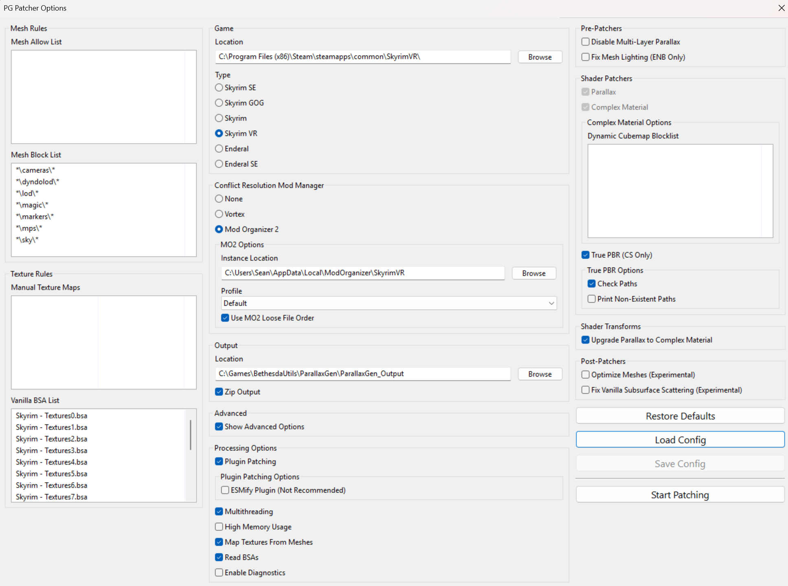
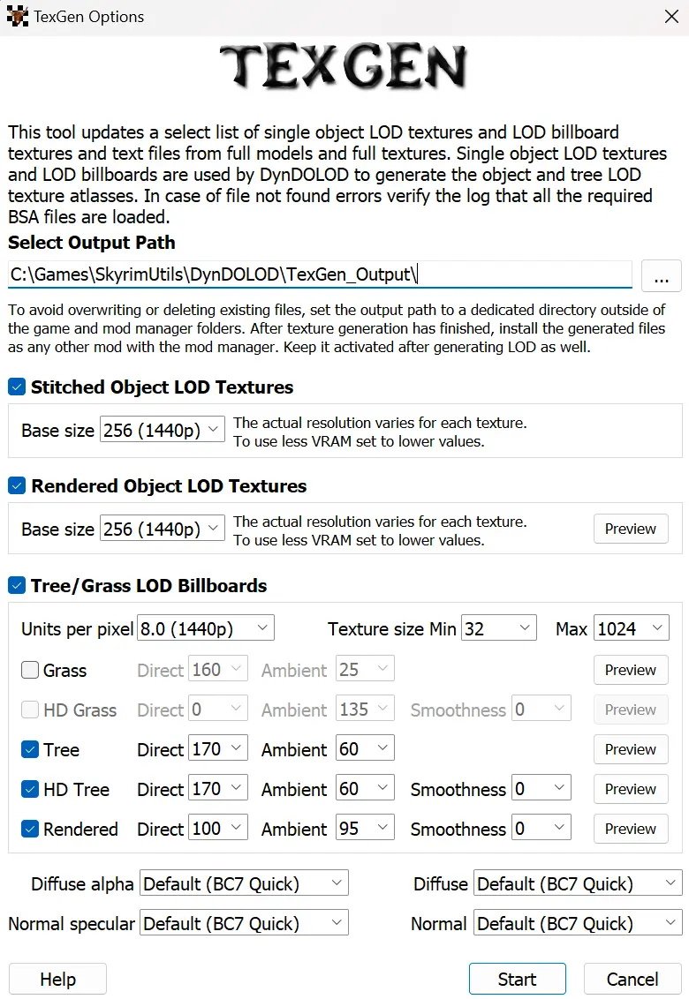

[Change Log](https://github.com/pluto-skyrimvr/pluto-skyrimvr.github.io/commits/main/)

# Introduction
The modlist follows the actual load order of the mods. i.e. the files of the mods in the top will be overwritten by the files of the mods that are placed below. Consider it as how mods are placed in the left panel of the Mod Organizer 2. The plugin(esp files) load order should be sorted by LOOT(Sort button in Mod Organizer 2).

# Modding Tools
## Mod Organizer
[Mod Organizer 2](https://www.nexusmods.com/skyrimspecialedition/mods/6194): De facto standard for any large modlists.

## Mod Organizer 2 Plugins
[Root Builder](https://www.nexusmods.com/skyrimspecialedition/mods/31720): To keep the original Skyrim VR directory clean, you should start using Root Builder.\
[NIF Preview](https://www.nexusmods.com/skyrimspecialedition/mods/69813): (Optional) You can compare the differnce between 3D meshes easily.\
[NIF Preview DLL Fix](https://github.com/aglowinthefield/modorganizer-preview_nif/releases): The original DLL from NIF Preview is outdated and does not work with the latest Mod Organizer 2. Download preview_nif.dll.\
[Bethesda Plugin Manager for Mod Organizer](https://www.nexusmods.com/skyrimspecialedition/mods/111236): (Optional) You can see the plugin record conflicts easily.\
[Bethesda Plugin Manager for Mod Organizer DLL Fix](https://www.mediafire.com/file/mi811ntoaswxb1f/bsplugins.dll/file): The original DLL is outdated and does not work with the latest Mod Organizer 2.

# Mod List

## Master Files
SSE Master Files: Create an empty mod and follow this [guide](https://www.nexusmods.com/skyrimspecialedition/articles/6529) to copy the latest master files from Skyrim Special Edition.\
CC Content: Create an empty mod and follow the same guide as above to copy CC Content files.\
[Survival Mode Prompt Removed](https://www.nexusmods.com/skyrimspecialedition/mods/59049): Download Disable Permanently version.

## Core
[Skyrim Script Extender for VR (SKSEVR)](https://www.nexusmods.com/skyrimspecialedition/mods/30457)\
[VR Address Library for SKSEVR](https://www.nexusmods.com/skyrimspecialedition/mods/58101)\
[Engine Fixes VR](https://www.nexusmods.com/skyrimspecialedition/mods/62089): Download both Main files. Use Root Builder for Part 2.\
[Skyrim VR ESL Support](https://www.nexusmods.com/skyrimspecialedition/mods/106712): Download Main, PapyrusUtil ESL Patch.\
[SkyUI VR](https://www.nexusmods.com/skyrimspecialedition/mods/91535)\
[SkyUI VR - Disable New Item Sort](https://www.nexusmods.com/skyrimspecialedition/mods/110564)\
[Unofficial Skyrim Special Edition Patch](https://www.nexusmods.com/skyrimspecialedition/mods/266): Download the latest version.\
[Unofficial High Definition Audio Project](https://www.nexusmods.com/skyrimspecialedition/mods/18115): Improves vanilla audio quality greatly including voices.\
[Skyrim Project Optimization SE](https://www.nexusmods.com/skyrimspecialedition/mods/14084): Download ESL version not because it is ESL but because it has USSEP changes.\
[eFPS - Exterior FPS boost](https://www.nexusmods.com/skyrimspecialedition/mods/54907)

## OpenComposite
[Skyrim VR OpenComposite Fixes Custom Build](https://www.nexusmods.com/skyrimspecialedition/mods/85389): (Optional) It improves performance for the OpenXR devices such as Meta Quest by skipping SteamVR(OpenVR) layer. Download the Main, SkyUI VR Fix. Use Root builder for the Main. A downside is that you cannot name your character in game because it does not have VR keyboard. You will have to edit its INI if you want to name your character.

## New Contents
[Missives](https://www.nexusmods.com/skyrimspecialedition/mods/17576): Radiant quests in job boards.\
[Missives - Worldspace Additions](https://www.nexusmods.com/skyrimspecialedition/mods/26788): Download Solstheim patch.\
[Missives - Carriage and Ferry Travel Overhaul Patch](https://www.nexusmods.com/skyrimspecialedition/mods/44498)\
[Missives - Notes Retexture](https://www.nexusmods.com/skyrimspecialedition/mods/46201): Download the main file and Solstheim addition.\
[Missives VR Fix Guide](https://www.nexusmods.com/skyrimspecialedition/mods/32507): Follow the guide to fix UI issue. It's a simple INI tweak.\
[The Forgotten City](https://www.nexusmods.com/skyrimspecialedition/mods/1179): (Optional) I normally stick to the vanilla contents but this one is too good to skip.

## Survival
[Dynamic Campsites](https://www.nexusmods.com/skyrimspecialedition/mods/106932)\
[Dynamic Campsites - 2K Retexture](https://www.nexusmods.com/skyrimspecialedition/mods/136009)\
[Dynamic Campsites - Blackreach Addon](https://www.nexusmods.com/skyrimspecialedition/mods/123707): Download ESPFE version.\
[Dynamic Campsites - SkyPatcher](https://www.nexusmods.com/skyrimspecialedition/mods/138542): Choose both Vendors and Value in the installer.\
[SunHelm Survival and needs](https://www.nexusmods.com/skyrimspecialedition/mods/39414): Choose Diseases, SkyrimVR in the installer.\
[Nordic UI Icons for Sunhelm and iNeed Widgets](https://www.nexusmods.com/skyrimspecialedition/mods/61823): Choose SunHelm, no for widget addon in the installer. This mod is a workaround to fix SunHelm's cold widget glitch that messes with SkyUI VR.\
[You Hunger SE](https://www.nexusmods.com/skyrimspecialedition/mods/9143)

## Adult Contents
[OStim Standalone - Advanced Adult Animation Framework](https://www.nexusmods.com/skyrimspecialedition/mods/98163): Download the matching version with the OStim Standalone VR.\
[OStim Standalone VR](https://www.nexusmods.com/skyrimspecialedition/mods/119892)\
[OStim Community Resource](https://www.nexusmods.com/skyrimspecialedition/mods/106519): Choose 3BA in the installer.\
[OCum Ascended - Cum and Orgasm Mechanics for OStim](https://www.nexusmods.com/skyrimspecialedition/mods/77506): Don't install UBE patch.\
[OSmp - Automatic SMP physics toggle for OStim](https://www.nexusmods.com/skyrimspecialedition/mods/72547)\
[Female Moan Voicesets For Ostim Standalone](https://www.nexusmods.com/skyrimspecialedition/mods/121383)\
[Amorous Adventures for Ostim](https://www.nexusmods.com/skyrimspecialedition/mods/48912)\
[Amorous Adventures for OStim Standalone - Patch and Fixes](https://www.nexusmods.com/skyrimspecialedition/mods/69248)\
[Amorous Adventures for Ostim - Script Fix](https://www.nexusmods.com/skyrimspecialedition/mods/90570)\
[Amorous Adventures OStim Standalone - OStim Sequences](https://www.nexusmods.com/skyrimspecialedition/mods/106773): Download the Main and Vampire Fix.\
[More Adventures For OStim](https://www.nexusmods.com/skyrimspecialedition/mods/66313)\
[Immersive Wenches](https://www.nexusmods.com/skyrimspecialedition/mods/595): Download the main file.\
[Immersive Wenches SE 2 - Ostim Patch](https://www.nexusmods.com/skyrimspecialedition/mods/152991)\
[An Evening With Angi](https://www.nexusmods.com/skyrimspecialedition/mods/74499): Download ESL version.

## Adult Animations
[Open Animations Romance and Erotica for OStim Standalone](https://www.nexusmods.com/skyrimspecialedition/mods/98732): Choose Keep OStim default icons in the installer.\
[Open Animations 3P Plus for OStim Standalone](https://www.nexusmods.com/skyrimspecialedition/mods/116829)\
[OStim SA Official Icon Patch for OARE and OA3PP](https://www.nexusmods.com/skyrimspecialedition/mods/106384): Download both Main files.\
[Lovemaking Compendium for OStim Standalone](https://www.nexusmods.com/skyrimspecialedition/mods/98271)\
[Night-blooming Violets for OStim Standalone](https://www.nexusmods.com/skyrimspecialedition/mods/98276)\
[Billyy's animations for Ostim Standalone](https://www.nexusmods.com/skyrimspecialedition/mods/102778): Choose rotation scene, all modules, Adapted furniture in the installer.\
[Billyy Wall Pack for OStim Standalone](https://www.nexusmods.com/skyrimspecialedition/mods/101838)\
[Billyy Table Pack for OStim Standalone](https://www.nexusmods.com/skyrimspecialedition/mods/99907)\
[Billyy Chair and Bench Pack for OStim Standalone](https://www.nexusmods.com/skyrimspecialedition/mods/98803)\
[Leito's animations for Ostim Standalone](https://www.nexusmods.com/skyrimspecialedition/mods/104775): Choose rotation scene, all modules, Adapted furniture in the installer.\
[Nibbles' animations for Ostim Standalone](https://www.nexusmods.com/skyrimspecialedition/mods/102528): Choose rotation scene, all modules, Adapted furniture in the installer.\
[Anub's animations for Ostim Standalone](https://www.nexusmods.com/skyrimspecialedition/mods/101918): Choose rotation scene, all modules, Adapted furniture, all face expressions in the installer.\
[BakaFactory's Animations for Ostim Standalone](https://www.nexusmods.com/skyrimspecialedition/mods/106473)\
[Milky's Animations for Ostim Standalone](https://www.nexusmods.com/skyrimspecialedition/mods/106875)

## Libraries and Utilities
[Spell Perk Item Distributor (SPID) VR](https://www.nexusmods.com/skyrimspecialedition/mods/59121): Download v6.8.2. The latest v7.1.3 has a problem with outfit distributions.\
[Base Object Swapper VR](https://www.nexusmods.com/skyrimspecialedition/mods/61734)\
[Keyword Item Distributor (KID)](https://www.nexusmods.com/skyrimspecialedition/mods/55728)\
[FormList Manipulator - FLM](https://www.nexusmods.com/skyrimspecialedition/mods/74037)\
[PapyrusUtil SE - Modders Scripting Utility Functions](https://www.nexusmods.com/skyrimspecialedition/mods/13048): Download VR version.\
[powerofthree's Papyrus Extender](https://www.nexusmods.com/skyrimspecialedition/mods/22854): Choose SSE v1.5.97("Special Edition") in the installer. The DLL will be replaced by the VR version below.\
[Papyrus Extender VR](https://www.nexusmods.com/skyrimspecialedition/mods/58296)\
[Papyrus Tweaks NG](https://www.nexusmods.com/skyrimspecialedition/mods/77779)\
[Papyrus Ini Manipulator](https://www.nexusmods.com/skyrimspecialedition/mods/65634)\
[Mfg Fix](https://www.nexusmods.com/skyrimspecialedition/mods/11669): Download the latest SE version, not the VR version. DLL will be overwritten by Mfg Fix NG.\
[Mfg Fix NG](https://www.nexusmods.com/skyrimspecialedition/mods/133568)\
[ConsoleUtilSSE NG](https://www.nexusmods.com/skyrimspecialedition/mods/76649)\
[Crash Logger VR](https://www.nexusmods.com/skyrimspecialedition/mods/59818): Download Main and VR PDB.\
[JContainers SE](https://www.nexusmods.com/skyrimspecialedition/mods/16495): Download VR version.\
[Save Unbaker VR](https://www.nexusmods.com/skyrimspecialedition/mods/86265)\
[UIExtensions](https://www.nexusmods.com/skyrimspecialedition/mods/17561): This mod is a soft requirement for many mods. Modders often forget to mention it because not having it doesn't break critical things.\
[RaceMenu](https://www.nexusmods.com/skyrimspecialedition/mods/19080): Download the Anniversary edition in the Main. Delete SKSE directory to delete skee64.dll and skee64.ini.\
[RacemenuVR](https://www.nexusmods.com/skyrimspecialedition/mods/156898)\
[SkyPatcher](https://www.nexusmods.com/skyrimspecialedition/mods/106659): Download VR version.\
[FSMP - Faster HDT-SMP](https://www.nexusmods.com/skyrimspecialedition/mods/57339): Download Main. Do not download XML VR which is not for 3BA body. For my system, I choose VR, NOT CUDA, AVX, No MCM - Extreme performance in the installer. The best options depend on your CPU type. Read this [wiki](https://en.wikipedia.org/wiki/Advanced_Vector_Extensions#CPUs_with_AVX) and decide it for yourself.\
[HDT-SMP Slot 32 Fix](https://www.nexusmods.com/skyrimspecialedition/mods/119010): Download VR version.\
[MCM Helper](https://www.nexusmods.com/skyrimspecialedition/mods/53000): Choose VR, ESL, BSA in the installer.\
[XEMI Utility](https://www.nexusmods.com/skyrimspecialedition/mods/159084): Choose VR in the installer.

## Weather
[Azurite Weathers](https://www.nexusmods.com/skyrimspecialedition/mods/42731): Download Azurite Weathers III in the Main.\
[Azurite III CS](https://www.nexusmods.com/skyrimspecialedition/mods/162153): Choose Reduced Bloom in the installer.\
[Obsidian Mountain Fogs](https://www.nexusmods.com/skyrimspecialedition/mods/13539)

## DynDOLOD
[DynDOLOD Resources SE 3](https://www.nexusmods.com/skyrimspecialedition/mods/52897): Choose everything only in Visual Options in the installer.\
[DynDOLOD DLL NG](https://www.nexusmods.com/skyrimspecialedition/mods/97720): Choose VR compatible version in the installer.\
[Far Object LOD Improvement Project SSE](https://www.nexusmods.com/skyrimspecialedition/mods/79197)

## Texture and Mesh (Base)
[Vanilla Remastered (Optimized) - Textures Upscaled and Reworked](https://www.nexusmods.com/skyrimspecialedition/mods/134352): Download Skyrim Remastered Part 1, Part 2, USSEP Patch.\
[Static Mesh Improvement Mod](https://www.nexusmods.com/skyrimspecialedition/mods/659): Install Lite version.\
[Static Mesh improvement Mod - SMIM - Quality Addon](https://www.nexusmods.com/skyrimspecialedition/mods/44388)\
[Unofficial Material Fix](https://www.nexusmods.com/skyrimspecialedition/mods/21027): Download Unofficial Material Fix version.\
[Assorted mesh fixes](https://www.nexusmods.com/skyrimspecialedition/mods/32117): Download the Main.

## Texture and Mesh (Misc)
[Book Covers Skyrim](https://www.nexusmods.com/skyrimspecialedition/mods/901)\
[CC's HQ Roadsigns SSE](https://www.nexusmods.com/skyrimspecialedition/mods/2778): Download HD.\
[WiZkiD Signs](https://www.nexusmods.com/skyrimspecialedition/mods/30481): Choose Movable by the wind version in the installer. Choose Interesting NPCs patch in the installer.\
[SD's Farmhouse Fences SE](https://www.nexusmods.com/skyrimspecialedition/mods/38912): Download 2k Farmhouse Fences SE Version 2.\
[LeanWolf's Better-Shaped Talos Statue with Greatsword SE](https://www.nexusmods.com/skyrimspecialedition/mods/4752): Choose High-Poly Statue, Nord Hero Greatsword in the installer.

## Roads
[Blended Roads](https://www.nexusmods.com/skyrimspecialedition/mods/8834): Choose Really Blended Roads for both Main and SMIM patch in the installer.

## Landscape
[Vanilla Landscape Corrections - VLC](https://www.nexusmods.com/skyrimspecialedition/mods/104962): Don't choose any patch in the installer.\
[Faultier's PBR Skyrim(Landscapes)](https://www.nexusmods.com/skyrimspecialedition/mods/125308): Download Faultier's PBR Landscapes 2k.\
[DrJacopo's - 3D Landscapes and Grass Library](https://www.nexusmods.com/skyrimspecialedition/mods/80687): Download the Meshes only.\
[Witchy Wilderness - Modular Grass Overhaul](https://www.nexusmods.com/skyrimspecialedition/mods/134287): Choose Full Installation, 2k Textures, None for Tundra Landscape Textures, No 3d Assets in the installer.\
[Cathedral - 3D Clover Plant](https://www.nexusmods.com/skyrimspecialedition/mods/68793): Download Full 3D PBR version.\
[Cathedral - 3D Deathbell](https://www.nexusmods.com/skyrimspecialedition/mods/76460)\
[Cathedral - 3D Dragons Tongue](https://www.nexusmods.com/skyrimspecialedition/mods/85694): Download Orange version.\
[Cathedral - 3D Lavender](https://www.nexusmods.com/skyrimspecialedition/mods/68310): Download Vanilla Size version in the Main, PBR textures in Optional files.\
[Cathedral - 3D Mountain Flowers](https://www.nexusmods.com/skyrimspecialedition/mods/41312)\
[Cathedral 3D Mountain Flower - Fixed Placement](https://www.nexusmods.com/skyrimspecialedition/mods/143566): Download BOS version.\
[Cathedral - 3D Nightshade](https://www.nexusmods.com/skyrimspecialedition/mods/81284): Choose Rally Edit - Dark and Desaturated in the installer.\
[Cathedral - 3D Pine Shrubs](https://www.nexusmods.com/skyrimspecialedition/mods/94791)\
[Cathedral - 3D Snow Berries](https://www.nexusmods.com/skyrimspecialedition/mods/69415): Download Green version.\
[Cathedral - 3D Stonecrop](https://www.nexusmods.com/skyrimspecialedition/mods/110726)\
[Cathedral - 3D Sword Ferns](https://www.nexusmods.com/skyrimspecialedition/mods/82978)\
[Cathedral - 3D Thistle](https://www.nexusmods.com/skyrimspecialedition/mods/67619)\
[Cathedral - 3D Tundra Cotton](https://www.nexusmods.com/skyrimspecialedition/mods/68068)\
[Cathedral - Mushrooms](https://www.nexusmods.com/skyrimspecialedition/mods/26103)\
[Cathedral PBR Plants](https://www.nexusmods.com/skyrimspecialedition/mods/135836): Choose Non Seasonal plants, Non-glowing default for Deathbell, Default and Patch for Interesting NPCs for Mountain Flowers, Orange color for Dragon Tongue, off for Dragon Tongue glow, Darker desaturated for Nightshade, Default for Snow Berries, Default for Stone Crop, Default for Sword Ferns, Default for Thistle, Default for Tundra Cotton, None for Thickets and Dead Shrubs, Default for Pine Shrubs, None for Tundra Scrubs, Some slimey mushrooms for Mushrooms in the installer.\
[PBR Flora Overhaul](https://www.nexusmods.com/skyrimspecialedition/mods/148782): Choose Non Seasonal plants, default options in the installer.\
[Diverse high-quality PBR shrubs](https://www.nexusmods.com/skyrimspecialedition/mods/154489): Choose Complete in the installer.\
[High Quality Ivy Replacer](https://www.nexusmods.com/skyrimspecialedition/mods/113578): Choose Variant 1 2K, Animated, Vanilla Stonewalls in the installer.\
[High Quality PBR Ivy](https://www.nexusmods.com/skyrimspecialedition/mods/129934): Download the regular High Quality PBR Ivy version. Choose Variant 1 2K in the installer.\
[Less Ugly Tundragrass](https://www.nexusmods.com/skyrimspecialedition/mods/26740): Download Redder variant.\
[Better Blended Mushrooms](https://www.nexusmods.com/skyrimspecialedition/mods/67725)\
[Better Blended Mushrooms Fix](https://www.nexusmods.com/skyrimspecialedition/mods/157604)\
[Lightwood Trees](https://www.nexusmods.com/skyrimspecialedition/mods/149007)\
[PBR Lightwood Trees](https://www.nexusmods.com/skyrimspecialedition/mods/154390): Download the Main and snowy fix.\
[Icy Mesh Remaster](https://www.nexusmods.com/skyrimspecialedition/mods/73381): Download both IcyFixes and Meshes in the Main.\
[Ice is Ice - Material Fix](https://www.nexusmods.com/skyrimspecialedition/mods/156807)\
[Better Dynamic Snow SE](https://www.nexusmods.com/skyrimspecialedition/mods/9121): Download the Main v3.x. Choose Brighter color, Default UVs, None for projected diffuse textures in the installer.\
[ERM - Enhanced Rocks and Mountains](https://www.nexusmods.com/skyrimspecialedition/mods/121336): Download the main meshes only.\
[ERM - Enhanced Rocks and Mountains - DynDOLOD Add-On](https://www.nexusmods.com/skyrimspecialedition/mods/88754)\
[Enhanced Rocks and Mountains - Fix and Addon](https://www.nexusmods.com/skyrimspecialedition/mods/142493): Choose Vanilla for Icy Caves, Skyforge Fix without Dirt, StoneRessource01 Fix in the installer.\
[ERMed - Blackreach Crystals](https://www.nexusmods.com/skyrimspecialedition/mods/147586): Download the Main.\
[HD Terrain Noise Texture SE](https://www.nexusmods.com/skyrimspecialedition/mods/47057)

## Landscape (Grass Cache)
[Grass Cache Helper NG](https://www.nexusmods.com/skyrimspecialedition/mods/101095)\
[No Grass In Objects](https://www.nexusmods.com/skyrimspecialedition/mods/42161): Download the Main, GrassControl.ini. Download MO2 plugin and place in your `/plugins` directory of MO2.

## Cities and Buildings
[Markarth Fixed AF](https://www.nexusmods.com/skyrimspecialedition/mods/82728): Choose Markarth Fixed AF(parallax) in the installer.\
[Whiterun Mesh Fixes](https://www.nexusmods.com/skyrimspecialedition/mods/48120)\
[Solitude Interiors Meshes Fixes](https://www.nexusmods.com/skyrimspecialedition/mods/78761): Download the Parallax version.\
[Windhelm Entrance Offset Fix - Base Object Swapper](https://www.nexusmods.com/skyrimspecialedition/mods/98207)\
[Sovngarde Meshes - FIXES](https://www.nexusmods.com/skyrimspecialedition/mods/150539): Download the Parallax version.\
[Dawnguard Fortress Improved](https://www.nexusmods.com/skyrimspecialedition/mods/9221)\
[Rally's Solstheim AIO](https://www.nexusmods.com/skyrimspecialedition/mods/36893): Choose 2K, LODs 512 and keep everything else as default in the installer.\
[Rally's Solstheim - Parallax](https://www.nexusmods.com/skyrimspecialedition/mods/51905): Download ParallaxGen version.\
[Tomato's PBR Whiterun](https://www.nexusmods.com/skyrimspecialedition/mods/135771): Download PBR 2k version.\
[Tomato's Riften and Ratway](https://www.nexusmods.com/skyrimspecialedition/mods/157340): Download PBR 2K version.\
[Exist's Farmhouses - PBR Retexture](https://www.nexusmods.com/skyrimspecialedition/mods/111230): Download PBR 2k version.\
[Exist's Imperial Forts - PBR Retexture](https://www.nexusmods.com/skyrimspecialedition/mods/118028): Download 2k version.\
[Exist's Caves - PBR Retexture](https://www.nexusmods.com/skyrimspecialedition/mods/131152): Download PBR 2k version.

## World Map
[A Clear Map of Skyrim and Other Worlds](https://www.nexusmods.com/skyrimspecialedition/mods/56367): Download the Main. Choose DynDOLOD 3, With DynDOLOD LOD32, Remove Clouds in the installer. DynDOLOD config will be explained later in the guide.

## Water
[Water for ENB](https://www.nexusmods.com/skyrimspecialedition/mods/37061): Choose Shades of Skyrim for CS, 4K Texture Resolution, Default Water Brightness, Default LOD Brightness, Transparent Waterfalls, 4K Resolution, Parallax, auto-selected patch(Landscape Fixes for Grass) in the installer. Further compatibility issues will be handled by Synthesis patcher later. (Optional) Choose available patches if you have mods that add new worldspaces such as The Forgotten City.

## Body
[XP32 Maximum Skeleton Special Extended](https://www.nexusmods.com/skyrimspecialedition/mods/1988): Choose Extended, XPMS(S)E latest, None for the rest in the installer.\
[XP32 First Person Skeleton CTD Bugfix for VR](https://www.nexusmods.com/skyrimspecialedition/mods/34301)\
[No Me Molestes Updated](https://www.nexusmods.com/skyrimspecialedition/mods/134937)\
[CBPC - CBP Physics with Collisions](https://www.nexusmods.com/skyrimspecialedition/mods/21224): Choose SkyrimVR, CBBE Curvy, Gravity Config in the installer. FPS and bounce amplitude config do not matter because they will be overwritten by the config from 3BBB.\
[Caliente's Beautiful Bodies Enhancer -CBBE-](https://www.nexusmods.com/skyrimspecialedition/mods/198): Choose Curvy, Underwear None. Untick Vanilla Outfits and Face Pack. Choose Eyebrow None. Untick Pubic Hair. Skip the options in the next page.\
[CBBE 3BBB](https://www.nexusmods.com/skyrimspecialedition/mods/30174): Uncheck pre-built body mesh. Choose Performance(balanced) and Full SMP. Choose Elasticity for CBPC Physics Preset and leave the rest as default. Option 1 for SMP Physics Preset. Choose CBPC - RegularSOS, Change vag*** collision, Don't add an** collision. Choose Deep Pink - 4K texture. Choose VRIK compatibility patch and None for Racemenu in the installer.\
[The New Gentleman](https://www.nexusmods.com/skyrimspecialedition/mods/104215): Choose Main Mesh in the installer.\
[BodySlide and Outfit Studio](https://www.nexusmods.com/skyrimspecialedition/mods/201)

## Bodyslide Presets
Any CBBE 3BA bodyslide presets you like will be okay. Here is the list of some fine selections.\
[Celestial Beings - Horoscope Body Shapes 3BA - BHUNP - CBBE](https://www.nexusmods.com/skyrimspecialedition/mods/51692?tab=files&file_id=213179)\
[Sapphires' Elegance (CBBE 3BA-Bodyslide Preset)](https://www.nexusmods.com/skyrimspecialedition/mods/51352)\
[Teraru's Scandalous Bodyslide Preset CBBE 3BA 3BBB](https://www.nexusmods.com/skyrimspecialedition/mods/54873)

## Body Texture
[BnP - Male Skin](https://www.nexusmods.com/skyrimspecialedition/mods/65402): Download 4K version. Choose Mature face normal, Moles, Moles with pubes, Moles standard with pubes, Dovakini, No Makeup, Pubes, Natural schlong, Veiny normal, 4 for vampire diffuse face, Humanlike vampire normal, No frost, Standard Sk in the installer.\
[Masculine Khajiit Textures (Grey Cat and Leopard)](https://www.nexusmods.com/skyrimspecialedition/mods/186): Download SOS Full 2K version.\
[Masculine Argonian Textures (Chameleon and Lizard)](https://www.nexusmods.com/skyrimspecialedition/mods/185): Download SOS Full 2K version.\
[Feminine Khajiit Textures (Grey Cat and Leopard) [CBBE]](https://www.nexusmods.com/skyrimspecialedition/mods/183): Download CBBE 2K version.\
[Feminine Argonian Textures (Chameleon and Lizard) [CBBE]](https://www.nexusmods.com/skyrimspecialedition/mods/184): Download CBBE 2K version.\
[Reverie - Skin](https://www.nexusmods.com/skyrimspecialedition/mods/184): Choose Sleek, Youthful, Natural, ECE Face, CBBE Body in the installer.

## Followers
[Nether's Follower Framework](https://www.nexusmods.com/skyrimspecialedition/mods/55653): Choose Skyrim Special Edition. Choose Followers Avoid Traps, Replace Base Dialogue Scripts in Core options. Choose Interesting NPCs, RDO, RDO Comments. Choose Friendly Fire in Spell Perk Item Distributor Files.\
[INIGO](https://www.nexusmods.com/skyrimspecialedition/mods/1461): (Optional) One of the best.

## More NPC
[Interesting NPCs SSE](https://www.nexusmods.com/skyrimspecialedition/mods/29194): Download the main file, hotfix, AI Overhaul patch.\
[Interesting NPCs - Zora Fair-Child voice enhanced](https://www.nexusmods.com/skyrimspecialedition/mods/27448): Zora's voice is hard to listen without this.\
[Interesting NPCs and WACCF Outfits Patch](https://www.nexusmods.com/skyrimspecialedition/mods/31858)\
[3dnpcs Fixes and Tweaks](https://www.nexusmods.com/skyrimspecialedition/mods/131274)

## NPC Overhaul
[High Poly Expressive NPCs](https://www.nexusmods.com/skyrimspecialedition/mods/41107): Download Nordic Faces version and HPENPC - Interesting NPCs.\
[Pandorable's NPCs](https://www.nexusmods.com/skyrimspecialedition/mods/19012): Choose USSEP version in the installer.\
[Pandorable's NPCs - Dawnguard](https://www.nexusmods.com/skyrimspecialedition/mods/24135): Download USSEP version.\
[Pandorable's NPCs - Dragonborn](https://www.nexusmods.com/skyrimspecialedition/mods/30680): Choose USSEP version in the installer.\
[Pan's Nameless Witches](https://www.nexusmods.com/skyrimspecialedition/mods/130245): Download ESL version.\
[Pan's Nameless Hunters](https://www.nexusmods.com/skyrimspecialedition/mods/134952): Download ESL version.\
[Pan's Nameless Vampires](https://www.nexusmods.com/skyrimspecialedition/mods/148741): Download ESL version.\
[Kalilies NPCs](https://www.nexusmods.com/skyrimspecialedition/mods/30247): Download loose files version to avoid black face bug.\
[Bijin Redux](https://www.nexusmods.com/skyrimspecialedition/mods/118328): Choose Original for alternative faces in the installer.\
[Trueblood Serana](https://www.nexusmods.com/skyrimspecialedition/mods/103713): Download V2B version. Choose Vampire version EFA, Soundwave(default) hair, Black hair, ED's Choice Facetint, No hood with hair, Use glowing eyes in the installer.\
[Serana Dialogue Edit](https://www.nexusmods.com/skyrimspecialedition/mods/16222)\
[RS Children Overhaul](https://www.nexusmods.com/skyrimspecialedition/mods/2650)\
[Axe's RS Children](https://www.nexusmods.com/skyrimspecialedition/mods/16044)\
[Cuyima Interesting NPCs SE](https://www.nexusmods.com/skyrimspecialedition/mods/27330): Download Custom Hair version.\
[Interesting NPCs Visual Overhaul](https://www.nexusmods.com/skyrimspecialedition/mods/40046)

## Face
[High Poly Head](https://vectorplexis.com/files/file/283-high-poly-head/): Choose BSA only, Special edition, Expressive Facegen Morphs, both EFA male and female, High Poly Hair, Vampire Head Fix, Symmetrical Eyes in the installer.\
[Expressive Facegen Morphs SE](https://www.nexusmods.com/skyrimspecialedition/mods/35785)\
[Simple Teeth Overhaul](https://www.nexusmods.com/skyrimspecialedition/mods/117349)\
[Hvergelmir's Aesthetics - Beards](https://www.nexusmods.com/skyrimspecialedition/mods/1067)\
[Hvergelmir's Aesthetics - Brows](https://www.nexusmods.com/skyrimspecialedition/mods/1062)\
[Northborn Scars](https://www.nexusmods.com/skyrimspecialedition/mods/720)\
[Eyes Nouveaux](https://www.nexusmods.com/skyrimspecialedition/mods/131210): Download Good version. Choose Alternative Blue eyes, Novelyst's Cut, Vanilla-like, No for Saints Seducers, No for tweaks in the installer.\
[High Quality Tintmasks for Various Mods](https://www.nexusmods.com/skyrimspecialedition/mods/18702): Download Relationship Dialogue Overhaul\
[High Quality Tintmasks - Immersive Wenches](https://www.nexusmods.com/skyrimspecialedition/mods/18355): Choose loose files in the installer.\
[Face Discoloration Fix](https://www.nexusmods.com/skyrimspecialedition/mods/42441)

## Hair
[KS Hairdos SSE](https://www.nexusmods.com/skyrimspecialedition/mods/6817): Download the complete package.\
[KS Hairdos 1.7 Salt and Wind](https://www.nexusmods.com/skyrimspecialedition/mods/44975): Download the main file, Bijin family(Choose Bijin, Warmaidens, Wives in the Installer), Cuyima Interesting NPCs, PAN NPC, PAN NPC DB, PAN NPC DG, RS Children patches.\
[Salt and Wind - KS Hairdos - Update](https://www.nexusmods.com/skyrimspecialedition/mods/64707)\
[Kalilies NPCs - Salt and Wind retexture](https://www.nexusmods.com/skyrimspecialedition/mods/44335)

## Creatures
[Dragons SE](https://www.nexusmods.com/skyrimspecialedition/mods/132218)\
[Diverse 4thUnknown Dragons](https://www.nexusmods.com/skyrimspecialedition/mods/146462): Download Main and High Res Textures.\
[Immersive Smilodons](https://www.nexusmods.com/skyrimspecialedition/mods/18429)\
[Supreme Vampire Lords](https://www.nexusmods.com/skyrimspecialedition/mods/19706)\
[Heartland Horses](https://www.nexusmods.com/skyrimspecialedition/mods/22083)\
[Tyrannical Trolls](https://www.nexusmods.com/skyrimspecialedition/mods/23665): Download vanilla size.\
[Savage Bear](https://www.nexusmods.com/skyrimspecialedition/mods/16343)\
[Gritty Goats](https://www.nexusmods.com/skyrimspecialedition/mods/26665)

## Armor and Weapons
[Weapons Armor Clothing and Clutter Fixes](https://www.nexusmods.com/skyrimspecialedition/mods/18994): Choose 2K(default). Do not choose any patches in the installer.\
[Armor and Clothing Extension](https://www.nexusmods.com/skyrimspecialedition/mods/19002): Download the Main and SPID Patch.\
[Weapons Armor Clothing and Clutter Fixes - CBBE 3BA patch (WACCF and ACE 3BA)](https://www.nexusmods.com/skyrimspecialedition/mods/110680): Choose WACCF, ACE, prebuilt meshes, None for Beast Race fixes in the installer.\
[Winter Is Coming SSE - Cloaks](https://www.nexusmods.com/skyrimspecialedition/mods/4933)\
[Open Face Guard Helmets](https://www.nexusmods.com/skyrimspecialedition/mods/13943)\
[ArteFakes - Unique Artifacts Replacer](https://www.nexusmods.com/skyrimspecialedition/mods/41254): Download the Main, the Update, Animation Replacer Patch.\
[Artificer - An Artifact Overhaul](https://www.nexusmods.com/skyrimspecialedition/mods/99619): Download the Main and Xavbio Textures Addon.\
[aljo's Artificer Patches](https://www.nexusmods.com/skyrimspecialedition/mods/99684): Download the Main. Choose ArteFakes patch in the installer. We do not need AI Overhaul patch because it will be handled by Synthesis patch later.

## Skimpy Outfits
[The Amazing World of Bikini Armors REMASTERED](https://www.sunkeumjeong.com/post/the-amazing-world-of-bikini-armors-remastered-6-0): Choose Physics, CBBE 3BAv2, Original Books, Vanilla footsteps, None for Leveled List Integration in the installer.\
[Tawoba 6.1 unofficial tweaks fixes smp](https://www.nexusmods.com/skyrimspecialedition/mods/111200)\
[The Expanded World of Bikini Armors - By PUMPKIN](https://www.nexusmods.com/skyrimspecialedition/mods/41585): Choose CBBE 3BA in the installer.\
[TEWOBA By PUMPKIN unofficial tweaks fixes smp](https://www.nexusmods.com/skyrimspecialedition/mods/165611)\
[Bikini Outfits Optimally Balanced - Skypatcher (B.O.O.B.S.)](https://www.nexusmods.com/skyrimspecialedition/mods/121122)\
[SPID Bikinification](https://www.nexusmods.com/skyrimspecialedition/mods/56894): Choose Bandits(Vanilla), Imperials, Thalmor, Wenches, None for Clean Plugin in the installer.\
[SPID Bikinification Fix](https://www.nexusmods.com/skyrimspecialedition/mods/136557)

## Texture and Mesh (Armor and Weapons)
[Armor Mesh Fixes SE](https://www.nexusmods.com/skyrimspecialedition/mods/39704): Download the main file only.\
[RUSTIC CLOTHING - Special Edition](https://www.nexusmods.com/skyrimspecialedition/mods/4703): Download 2K version.\
[Robes Retexture SE](https://www.nexusmods.com/skyrimspecialedition/mods/110655): Download HalfRes version. Choose Install everything, Fishing, Green version for Necromancer Robes, Mage Robes and Priest Robes for Armor and Clothing Extension consistency patch in the installer.\
[Imperial Armors and Weapons Retexture SE](https://www.nexusmods.com/skyrimspecialedition/mods/86097): Download HalfRes version. Choose everything under Vanilla Items, Cubemap Addon, and leave the rest as default in the installer.\
[Guards and Stormcloaks Armors Retexture SE](https://www.nexusmods.com/skyrimspecialedition/mods/98115): Download HalfRes version. Choose everything under Vanilla Items, No Meshes - Textures Only for Guard Sleeves, No Meshes - Textures Only for Stormcloak Officer Sleeves, Open Face Guard Helmet patch in the installer.\
[Thieves Guild Armors Retexture SE](https://www.nexusmods.com/skyrimspecialedition/mods/98561): Download HalfRes version. Do not choose any patches in the installer.\
[Nightingale Armor and Weapons Retexture SE](https://www.nexusmods.com/skyrimspecialedition/mods/91723): Download HalfRes version. Choose everything under Vanilla Items in the installer.\
[Stalhrim Armors and Weapons Retexture SE](https://www.nexusmods.com/skyrimspecialedition/mods/96204): Download HalfRes version. Choose Vanilla Meshes, everything under Vanilla Items in the installer.\
[Bonemold Armors and Weapons Retexture SE](https://www.nexusmods.com/skyrimspecialedition/mods/94859): Download HalfRes version. Choose everything under Vanilla Items, CC Curios in the installer.\
[Chitin Armors Retexture SE](https://www.nexusmods.com/skyrimspecialedition/mods/94529): Download HalfRes version. Choose everything under Vanilla Items in the installer.\
[Ancient Nord Armors and Weapons Retexture SE](https://www.nexusmods.com/skyrimspecialedition/mods/91136): Download No Consistency Patches-Half version. Choose everything under Vanilla Items, Ancient nordic for Helm of Yngol, Fishing Weapons for CC Items in the installer.\
[Falmer Armors and Weapons Retexture SE](https://www.nexusmods.com/skyrimspecialedition/mods/90711): Download HalfRes version. Choose everything under Vanilla Items in the installer.\
[Forsworn Armors and Weapons Retexture SE](https://www.nexusmods.com/skyrimspecialedition/mods/99610): Download HalfRes version. Choose everything under Vanilla Items in the installer.\
[Saints and Seducers Retexture SE](https://www.nexusmods.com/skyrimspecialedition/mods/151116): Download HalfRes version. Choose everything under Base Install, Vanilla Weapons Version for meshes in the installer.\
[Weapons and Armors Remastered - PBR and Complex Materials](https://www.nexusmods.com/skyrimspecialedition/mods/148690): Download PBR 2K version.\
[Scimitar Replacer SE](https://www.nexusmods.com/skyrimspecialedition/mods/28483): Download the Main.\
[Gemling Queen Jewelry SE](https://www.nexusmods.com/skyrimspecialedition/mods/4294): Install everything. Amulet texture 512, Ring texture combined 1K recommended. Delete esp file. It's not needed because the fix is included in USSEP.\
[JS Vanilla Circlets SE](https://www.nexusmods.com/skyrimspecialedition/mods/131813): Download 2K version and Artificer patch.

## Skimpy Outfits (Vanilla Replacer)
[Remodeled Armor for CBBE SSE](https://www.nexusmods.com/skyrimspecialedition/mods/22168): Download the Main. Choose Vanilla Replacer, WACCF Patch, ACE Patch, Immersive Sounds - Compendium patches in the installer.\
[Yet Another Elders Modesty Mod-Skypatched](https://www.nexusmods.com/skyrimspecialedition/mods/130004)

## Loot and Encounter Zones
[Open World Loot - Encounter Zone and Loot Overhaul](https://www.nexusmods.com/skyrimspecialedition/mods/49681): Download the Main, WACCF and Armor and Clothing Extension patch.\
[Open World Loot - Heritage Enemies 2 Patch](https://www.nexusmods.com/skyrimspecialedition/mods/58277)\
[Encounter Zones Unlocked SE](https://www.nexusmods.com/skyrimspecialedition/mods/19608): Download the VR version.\
[Locational Encounter Zones](https://www.nexusmods.com/skyrimspecialedition/mods/85212)\
[Enemies Respect Encounter Zones](https://www.nexusmods.com/skyrimspecialedition/mods/78847)

## Combat and Enemies
[Blade and Blunt - A Combat Overhaul](https://www.nexusmods.com/skyrimspecialedition/mods/34549): Choose No Kill Moves in the installer.\
[Blade and Blunt VR](https://www.nexusmods.com/skyrimspecialedition/mods/120494)\
[Pseudo Physical Weapon Collision and Parry AE SE VR](https://www.nexusmods.com/skyrimspecialedition/mods/100781): Download VR version.\
[Pseudo Physical Weapon Collision and Parry - a more grounded config file](https://www.nexusmods.com/skyrimspecialedition/mods/162758)\
[No Stagger Mod](https://www.nexusmods.com/skyrimspecialedition/mods/16335): Player being staggered in VR is weird. This mod removes it completely.\
[The Restless Dead (A Draugr and Skeleton Overhaul)](https://www.nexusmods.com/skyrimspecialedition/mods/94100): Choose Default difficulty, USSEP, WACCF patches in the installer.\
[Disable Draugr Combat Idles (Taunts)](https://www.nexusmods.com/skyrimspecialedition/mods/91398)\
[Heritage Enemies 2](https://www.nexusmods.com/skyrimspecialedition/mods/55989): Download Texture BSA version and WACCF patch. Delete `Meshes/armor/dbarmor/dbarmorsleeveless_1.nif` that conflicts with Armor Mesh Fixes.\
[Diplomatic Dragons](https://www.nexusmods.com/skyrimspecialedition/mods/70803)\
[Dragons Use Thu'um](https://www.nexusmods.com/skyrimspecialedition/mods/87085): Download the Main.\
[NPCs use Potions](https://www.nexusmods.com/skyrimspecialedition/mods/67489): Choose auto-selected patches(Poison Dosage Preset, Inigo, Apothecary, SunHelm, Interesting NPCs, Carriage and Ferry Travel Overhaul, Immersive Wenches) in the installer.\
[NPCs Learn to Aim (Skill-Based Aiming)](https://www.nexusmods.com/skyrimspecialedition/mods/117908): Choose VR version, No for player aiming in the installer.

## Animation
[Expressive Facial Animation -Female Edition-](https://www.nexusmods.com/skyrimspecialedition/mods/19181)\
[Expressive Facial Animation -Male Edition-](https://www.nexusmods.com/skyrimspecialedition/mods/19532)\
[Pandora Behaviour Engine Plus](https://www.nexusmods.com/skyrimspecialedition/mods/133232): Download x64 version unless you are on 32-bit PC.\
[Paired Animation Improvements](https://www.nexusmods.com/skyrimspecialedition/mods/99621)\
[Animation Queue Fix](https://www.nexusmods.com/skyrimspecialedition/mods/82395)\
[Open Animation Replacer](https://www.nexusmods.com/skyrimspecialedition/mods/92109)\
[Behavior Data Injector](https://www.nexusmods.com/skyrimspecialedition/mods/78146)\
[Behavior Data Injector Universal Support](https://www.nexusmods.com/skyrimspecialedition/mods/78159)\
[Combat Pathing Revolution](https://www.nexusmods.com/skyrimspecialedition/mods/86950)\
[Combat Pathing Revolution VR](https://www.nexusmods.com/skyrimspecialedition/mods/87895)\
[Animation Motion Revolution](https://www.nexusmods.com/skyrimspecialedition/mods/50258)\
[Payload Interpreter](https://www.nexusmods.com/skyrimspecialedition/mods/65089): It should be enabled in Pandora Behaviour Engine Plus later.\
[BFCO - Attack Behavior Framework](https://www.nexusmods.com/skyrimspecialedition/mods/117052): Choose VR and leave the rest as default in the installer.\
[BFCO Universal Support](https://www.nexusmods.com/skyrimspecialedition/mods/120091)\
[SCAR - Skyrim Combos AI Revolution](https://www.nexusmods.com/skyrimspecialedition/mods/72014): Choose the Default Animation pack in the installer.\
[SCAR VR - Skyrim Combos AI Revolution VR](https://www.nexusmods.com/skyrimspecialedition/mods/89492)\
[SCAR Stamina Limitation Patch](https://www.nexusmods.com/skyrimspecialedition/mods/72451)\
[Smooth Moveset](https://www.nexusmods.com/skyrimspecialedition/mods/70531)\
[Smooth Moveset (CPR)](https://www.nexusmods.com/skyrimspecialedition/mods/140499)\
[mcgFemaleWalk for Skyrim SE](https://www.nexusmods.com/skyrimspecialedition/mods/13640): Remove esp because we don't need movement speed change.\
[Sneak Animation SSE](https://www.nexusmods.com/skyrimspecialedition/mods/4371): It fixes awkward sneak stance animation.\
[Super Fast Get Up Animation](https://www.nexusmods.com/skyrimspecialedition/mods/46714)\
[EVG Conditional Idles](https://www.nexusmods.com/skyrimspecialedition/mods/34006)\
[Take a Seat - New Sitting Animations for OAR or DAR](https://www.nexusmods.com/skyrimspecialedition/mods/54193): Download the OAR version.\
[Improved Table Transition Animations](https://www.nexusmods.com/skyrimspecialedition/mods/84160)\
[Improved Idle Laydown Animations](https://www.nexusmods.com/skyrimspecialedition/mods/99691): Download the OAR version.\
[NPC Animation Remix (OAR)](https://www.nexusmods.com/skyrimspecialedition/mods/63471)\
[Gesture Animation Remix (OAR)](https://www.nexusmods.com/skyrimspecialedition/mods/64420)\
[Arm Movement Animations (OAR)](https://www.nexusmods.com/skyrimspecialedition/mods/62849)\
[Conditional tavern cheering (OAR)](https://www.nexusmods.com/skyrimspecialedition/mods/63029)\
[Hammering Animation and Sound Fixes](https://www.nexusmods.com/skyrimspecialedition/mods/142807)\
[Vanilla Eating Animation Fixes](https://www.nexusmods.com/skyrimspecialedition/mods/120727)\
[Barstool Exit Animation Fix](https://www.nexusmods.com/skyrimspecialedition/mods/144556)\
[Flute Animation Fix](https://www.nexusmods.com/skyrimspecialedition/mods/69609): Choose XP32/XMPSSE for female, XP32/None for male in the installer.

## Gameplay
[Ralof or Hadvar (alternate start)](https://www.nexusmods.com/skyrimspecialedition/mods/14553): Download the regular ESPf version, not the 3 torches version.\
[Adamant - A Perk Overhaul](https://www.nexusmods.com/skyrimspecialedition/mods/30191): Download the Main, Bard Perks Addon, Smithing Addon.\
[Adamant - WACCF patch](https://www.nexusmods.com/skyrimspecialedition/mods/37764)\
[Adamant Tweaks for ADXP and VR](https://www.nexusmods.com/skyrimspecialedition/mods/94555): Download the Main, Bard Perks Addon Tweaks.\
[Hand to Hand - An Adamant Addon](https://www.nexusmods.com/skyrimspecialedition/mods/59790): Download the Main, Trainers and Skill Books addon in Optional Files, BSC patch in Misc Files.\
[Hand to Hand - An Adamant Addon VR DLL](https://www.nexusmods.com/skyrimspecialedition/mods/127697)\
[Adamant Hand to Hand Tweaks for ADXP and VR](https://www.nexusmods.com/skyrimspecialedition/mods/94179)\
[Mysticism - A Magic Overhaul](https://www.nexusmods.com/skyrimspecialedition/mods/27839)\
[Mundus - A Standing Stone Overhaul](https://www.nexusmods.com/skyrimspecialedition/mods/33411): Do not choose USSEP patch in the installer.\
[Aetherius - A Race Overhaul](https://www.nexusmods.com/skyrimspecialedition/mods/26686): Do not choose optional module files in the installer.\
[Scion - A Vampire Overhaul](https://www.nexusmods.com/skyrimspecialedition/mods/41639)\
[Manbeast - A Werewolf Overhaul](https://www.nexusmods.com/skyrimspecialedition/mods/44746)\
[Thaumaturgy - An Enchanting Overhaul](https://www.nexusmods.com/skyrimspecialedition/mods/57138): Download the Main and Weapon Enchantment XP Tweak.\
[Apothecary - An Alchemy Overhaul](https://www.nexusmods.com/skyrimspecialedition/mods/52130): Download the Main, Fishing Patch, Rare Curios Patch, Saints and Seducers Patch.\
[Misc Apothecary Patches](https://www.nexusmods.com/skyrimspecialedition/mods/79641): Choose auto-selected patches(3DNPC, Book Covers Skyrim, Heritage 2) in the installer.\
[Alchemy Plus](https://www.nexusmods.com/skyrimspecialedition/mods/80882): Download VR version.\
[Gourmet](https://www.nexusmods.com/skyrimspecialedition/mods/96876): Download the Main, Fishing Patch, Simonrim Patches, Survival Patch, USSEP Patch.

## Audio
[Binaural 3D Surround Sound for Headphones - HRTF](https://www.nexusmods.com/skyrimspecialedition/mods/26916): Download VR version. Use Root Builder.\
[Sound Record Distributor](https://www.nexusmods.com/skyrimspecialedition/mods/77815)\
[Acoustic Space Improvement Fixes](https://www.nexusmods.com/skyrimspecialedition/mods/78992): Choose USSEP, Reverb Interior Sounds Expansion patches in the installer.\
[Reverb Interior Sounds Expansion](https://www.nexusmods.com/skyrimspecialedition/mods/77947): Choose the default options and VR user in the installer.\
[Audio Overhaul for Skyrim SE](https://www.nexusmods.com/skyrimspecialedition/mods/12466): Make sure all the recommended mods(Acoustic Space Improvement Fixes, Reverb Interior Sounds Expansion) are enabled in the installer. Choose auto-selected patches(none) in the installer.\
[Immersive Sounds - Compendium](https://www.nexusmods.com/skyrimspecialedition/mods/523): Choose the default options in the installer.\
[Immersive Sounds Compendium Drinking Sound Fix](https://www.nexusmods.com/skyrimspecialedition/mods/58623)\
[Audio Overhaul - Immersive Sounds Integration (AOS - ISC Compatibility Patch)](https://www.nexusmods.com/skyrimspecialedition/mods/36761)\
[Regional Sounds Expansion](https://www.nexusmods.com/skyrimspecialedition/mods/77829)\
[More Painful NPC Death Sounds SE](https://www.nexusmods.com/skyrimspecialedition/mods/25702): Download Main and plugin update.\
[BA Bard Songs](https://www.nexusmods.com/skyrimspecialedition/mods/47202)\
[Mute The Music](https://www.nexusmods.com/skyrimspecialedition/mods/37498): (Optional) You can mute any music that annoys you.\
[Wildwood Echoes](https://www.nexusmods.com/skyrimspecialedition/mods/112008): Choose Wildwood Echoes - Full in the installer.\
[Murder of Songbirds](https://www.nexusmods.com/skyrimspecialedition/mods/111766): Choose High Quality wav, Adjusted Climates in the installer.

## Visual FX
[Core Impact Framework (CIF)](https://www.nexusmods.com/skyrimspecialedition/mods/146873)\
[Sanguine Symphony](https://www.nexusmods.com/skyrimspecialedition/mods/148388)\
[Next-Gen Decapitations](https://www.nexusmods.com/skyrimspecialedition/mods/135254)\
[FleshFX](https://www.nexusmods.com/skyrimspecialedition/mods/27456)\
[Mysticism - FleshFX Patch](https://www.nexusmods.com/skyrimspecialedition/mods/46997)\
[Vibrant Weapons EAE](https://www.nexusmods.com/skyrimspecialedition/mods/111430)\
[Vibrant Weapons EAE - Enchantment Lights](https://www.nexusmods.com/skyrimspecialedition/mods/136564)\
[Enchantment Art Extender](https://www.nexusmods.com/skyrimspecialedition/mods/105492): Download the Main and the optional Vibrant Weapons config.\
[Enchantment Art Extender VR 2](https://www.nexusmods.com/skyrimspecialedition/mods/142337)\
[Deadly Spell Impacts](https://www.nexusmods.com/skyrimspecialedition/mods/12939): Choose default in the installer.\
[A Patch For Deadly Spell Impacts and Audio Overhaul - Immersive Sounds Integration](https://www.nexusmods.com/skyrimspecialedition/mods/57465): Download the Main.\
[Improved Weapon Impact EFFECTS Correct Metal SE](https://www.nexusmods.com/skyrimspecialedition/mods/8936)\
[Improved Sparks](https://www.nexusmods.com/skyrimspecialedition/mods/19831): Download 2x impact effects.\
[Rally's Candlelight and Magelight Fix SE - VR](https://www.nexusmods.com/skyrimspecialedition/mods/36594): Choose No Glow for Candlelight, No Glow for Magelight, No Glow for Mysticism Patch in the installer.\
[Footprints](https://www.nexusmods.com/skyrimspecialedition/mods/3808)\
[SPID for Footprints](https://www.nexusmods.com/skyrimspecialedition/mods/54924)\
[Footprints - Alternative Design](https://www.nexusmods.com/skyrimspecialedition/mods/109544)\
[Ultimate fix - SPID for Footprins](https://www.nexusmods.com/skyrimspecialedition/mods/96086): Choose child addon, SPID and KID in the installer.\
[Realistic PBR Footprints](https://www.nexusmods.com/skyrimspecialedition/mods/140780): Choose auto-selected patches(Sand Patch, Ultimate Fix) in the installer.

## Texture and Mesh (Late Order)
[Faultier's PBR Skyrim](https://www.nexusmods.com/skyrimspecialedition/mods/125308): Download Faultier's PBR Skyrim AIO 2k and PBR Windows.\
[Windhelm Improvements (Snowy Windhelm)](https://www.nexusmods.com/skyrimspecialedition/mods/27696): Choose Main files in the installer. The mod comes with LE version of meshes. Run NIF optimizer on the meshes if possible.\
[Modern Hay - PBR and CM](https://www.nexusmods.com/skyrimspecialedition/mods/155815): Download PBR 2K version.\
[Book Covers Skyrim PBR](https://www.nexusmods.com/skyrimspecialedition/mods/155254): Download Book Covers Skyrim PBR - Original.\
[Embers XD](https://www.nexusmods.com/skyrimspecialedition/mods/37085): Choose Embers XD Flames, High Quality effect, Normal particle light intensity, ESP + Master, Forges Add-on, Lava Craters Add-on, Remove Fake Glow, Solitude Braziers, SunHelm Survival in the installer.

## Lighting
[Ambient Templates for Lighting Mods](https://www.nexusmods.com/skyrimspecialedition/mods/153425): Choose VR, Yes for HDR, Level 65 for both in the installer.\
[Light Placer](https://www.nexusmods.com/skyrimspecialedition/mods/127557): Choose SE in the installer.\
[Light Placer VR](https://www.nexusmods.com/skyrimspecialedition/mods/135822)\
[Flayan's Tweaks](https://www.nexusmods.com/skyrimspecialedition/mods/137944)\
[True Light](https://www.nexusmods.com/skyrimspecialedition/mods/135488): Choose Yes for WSU, True Light - Exterior, Dwemer Swap BOS addon, FX Glow Remover BOS, USSEP patch in the installer.\
[CS Light](https://www.nexusmods.com/skyrimspecialedition/mods/138443): Choose True Light for Lighting Type, Regular for Dwemer Lights, everything for Additional lights, Regular Soulgems, Cathedral - 3D Deathbell ISL, Dim for Potion Light Intensity, CS Light for Magic effects ISL, Interior Windows Lights in the installer.\
[iLluminous Elementals](https://www.nexusmods.com/skyrimspecialedition/mods/138128): Choose everything available in the installer.\
[Window Shadows Ultimate](https://www.nexusmods.com/skyrimspecialedition/mods/150494): Choose Brightest for Window Glow, Normal for Light Rays, Faultier's PBR Windows in the installer.\
[Window Emittance Consistency (WEC)](https://www.nexusmods.com/skyrimspecialedition/mods/158918): Choose WEC - Mild in the installer.\
[Dynamic Interior Ambient Lighting (DIAL)](https://www.nexusmods.com/skyrimspecialedition/mods/149920): Choose Azurite III, Default brightness, No for Seasonal Weathers Framework, No for Lux in the installer.

## Shaders
[Community Shaders](https://www.nexusmods.com/skyrimspecialedition/mods/86492)\
[Grass Lighting](https://www.nexusmods.com/skyrimspecialedition/mods/86502)\
[Grass Collision](https://www.nexusmods.com/skyrimspecialedition/mods/87816)\
[Wetness Effects](https://www.nexusmods.com/skyrimspecialedition/mods/112739)\
[Subsurface Scattering](https://www.nexusmods.com/skyrimspecialedition/mods/114114)\
[Skylighting](https://www.nexusmods.com/skyrimspecialedition/mods/139352)\
[Sky Sync](https://www.nexusmods.com/skyrimspecialedition/mods/153543)\
[Cloud Shadows](https://www.nexusmods.com/skyrimspecialedition/mods/139185)\
[Water Effects](https://www.nexusmods.com/skyrimspecialedition/mods/112762)\
[Terrain Variation](https://www.nexusmods.com/skyrimspecialedition/mods/148123)\
[Extended Translucency](https://www.nexusmods.com/skyrimspecialedition/mods/150755)\
[Inverse Square Lighting](https://www.nexusmods.com/skyrimspecialedition/mods/153542)\
[Upscaling](https://www.nexusmods.com/skyrimspecialedition/mods/156952)

## Immersion
[Animated Ships](https://www.nexusmods.com/skyrimspecialedition/mods/110260)\
[The Gildergreen Fix](https://www.nexusmods.com/skyrimspecialedition/mods/128828)\
[Carriage and Ferry Travel Overhaul](https://www.nexusmods.com/skyrimspecialedition/mods/8379): Download the Main.\
[Carriage and Ferry Travel Overhaul - Fixes and Winterhold](https://www.nexusmods.com/skyrimspecialedition/mods/40651): Choose Vanilla, ESL-flagged for Covered Carriages, ESL-flagged for Lanterns in the installer.\
[Northern Bathhouses - SSE](https://www.nexusmods.com/skyrimspecialedition/mods/16565): Tested all the bathing mods but this simple mod was the best in my opinion.\
[Realistic Boat Bobbing SE](https://www.nexusmods.com/skyrimspecialedition/mods/26080): Choose Main, SMIM, USSEP patch in the installer.\
[Improved College Entry - Questline Tweaks](https://www.nexusmods.com/skyrimspecialedition/mods/22184)\
[WiZkiD Wells with real water](https://www.nexusmods.com/skyrimspecialedition/mods/57208)\
[Security Overhaul SKSE - Lock Variations](https://www.nexusmods.com/skyrimspecialedition/mods/58224): Choose 2K textures and any DLL in the installer. VR version of DLL will overwrite it.\
[Security Overhaul SKSEVR - Lock Variations VR](https://www.nexusmods.com/skyrimspecialedition/mods/58298)\
[Security Overhaul SKSE - Add-ons](https://www.nexusmods.com/skyrimspecialedition/mods/59529): Choose 2K textures in the installer.\
[Security Overhaul SKSE - Extra Locks](https://www.nexusmods.com/skyrimspecialedition/mods/126119): Choose 2K textures in the installer.\
[Security Overhaul SKSE - Regional Locks](https://www.nexusmods.com/skyrimspecialedition/mods/62781): Choose 2K textures in the installer.\
[Moons and Stars - Sky Overhaul SKSE](https://www.nexusmods.com/skyrimspecialedition/mods/73336): Choose Special Edition in the installer.\
[Moons and Stars - Sky Overhaul SKSEVR](https://www.nexusmods.com/skyrimspecialedition/mods/73667)\
[Bandit Lines Expansion](https://www.nexusmods.com/skyrimspecialedition/mods/63733)\
[Journeyman - A Fast Travel Overhaul](https://www.nexusmods.com/skyrimspecialedition/mods/92220): Download the matching version with Journeyman VR.\
[Journeyman VR](https://www.nexusmods.com/skyrimspecialedition/mods/139443)\
[Journeyman - SkyPatcher](https://www.nexusmods.com/skyrimspecialedition/mods/148309)\
[Fancy Fishing - Minigame and Tweaks](https://www.nexusmods.com/skyrimspecialedition/mods/89352): Choose No rod(for VR), Install VR settings on by default plugin, default for the rest options in the installer.

## Economy
[Roleplaying in Skyrim - Evolving Economy](https://www.nexusmods.com/skyrimspecialedition/mods/149830)\
[Honed Metal -NPC Crafting and Enchanting Services-](https://www.nexusmods.com/skyrimspecialedition/mods/61015): Download Main. Choose ESL flagged Base, 1.4.15 SKSE VR plugin in the installer.\
[Honed Thaumaturgy (FLM)](https://www.nexusmods.com/skyrimspecialedition/mods/104295)\
[Recipe Auto-Learn](https://www.nexusmods.com/skyrimspecialedition/mods/84909)

## AI Improvement
[AI Overhaul SSE](https://www.nexusmods.com/skyrimspecialedition/mods/21654): Download AE version. Choose AI Overhaul(Recommended) in the installer. For your information, you do not need any compatibilty patches for vanilla NPCs because the compatibility will be automatically resolved by the Synthesis patch later.\
[Guard Dialogue Overhaul SE](https://www.nexusmods.com/skyrimspecialedition/mods/22075): Download ESL version.\
[Guard Dialogue Overhaul - UHDAP Patch](https://www.nexusmods.com/skyrimspecialedition/mods/36366)\
[Relationship Dialogue Overhaul - RDO SE](https://www.nexusmods.com/skyrimspecialedition/mods/1187): Do not download any patches.\
[Relationship Dialogue Overhaul - Update and MCM](https://www.nexusmods.com/skyrimspecialedition/mods/44601): Download the main file and UHDAP patch.\
[Misc Dialogue Edits](https://www.nexusmods.com/skyrimspecialedition/mods/28904): Install auto-selected patch(none) in the installer.\
[More Dialogue Options](https://www.nexusmods.com/skyrimspecialedition/mods/28905): Choose Guard Dialogue Overhaul ESL version in the installer.\
[Run For Your Lives](https://www.nexusmods.com/skyrimspecialedition/mods/2272): Download the latest version.\
[NPC AI Process Position Fix - NG](https://www.nexusmods.com/skyrimspecialedition/mods/69326): Choose AI Overhaul in the installer.

## Bug Fixes and Tweaks
[Landscape Fixes For Grass Mods](https://www.nexusmods.com/skyrimspecialedition/mods/9005): Download the Main.\
[Lightened Skyrim - Base Object Swapper edition](https://www.nexusmods.com/skyrimspecialedition/mods/111475)\
[No Spinning Death Animation](https://www.nexusmods.com/skyrimspecialedition/mods/1432): Download Merged version.\
[To Your Face SE and VR](https://www.nexusmods.com/skyrimspecialedition/mods/24720)\
[Skyrim VR USSEP Dwarven Ballista missing texture fix](https://www.nexusmods.com/skyrimspecialedition/mods/18722)\
[Dawnguard Don't Hunt Cured Vampires](https://www.nexusmods.com/skyrimspecialedition/mods/5471)\
[No More Standing Too Close SSE](https://www.nexusmods.com/skyrimspecialedition/mods/4784)\
[FloraFixer - Mutagen Patcher and Data](https://www.nexusmods.com/skyrimspecialedition/mods/42057): Synthesis patch will be built later.\
[Drunk Sinking Head Idle Fix SE](https://www.nexusmods.com/skyrimspecialedition/mods/22143)\
[Improved Bound Sword and Dagger Collision](https://www.nexusmods.com/skyrimspecialedition/mods/60064)\
[Increase Actor Limit for VR](https://www.nexusmods.com/skyrimspecialedition/mods/37440)\
[powerofthree's Tweaks](https://www.nexusmods.com/skyrimspecialedition/mods/51073): Choose SE version in the installer.\
[powerofthree's Tweaks VR](https://www.nexusmods.com/skyrimspecialedition/mods/59510)\
[Navigator - Navmesh Fixes](https://www.nexusmods.com/skyrimspecialedition/mods/52641): Choose All-in-one, esl and Interesting NPC patch(auto-selected) in the installer.\
[Mu Joint Fix (Knee Fix dll edition)](https://www.nexusmods.com/skyrimspecialedition/mods/61479): Download Main and SL-OStim patch. Choose VR version in the installer.\
[Animated Static Reload Fix - NG](https://www.nexusmods.com/skyrimspecialedition/mods/69331)\
[Enhanced Invisibility VR](https://www.nexusmods.com/skyrimspecialedition/mods/63889)\
[Recursion Monitor](https://www.nexusmods.com/skyrimspecialedition/mods/76867)\
[OnMagicEffectApply Replacer](https://www.nexusmods.com/skyrimspecialedition/mods/67968): Download OnMagicEffectApply Replacer Effective version.\
[Vanilla Scripting Enhancements](https://www.nexusmods.com/skyrimspecialedition/mods/68139): Download loose files version.\
[Dual Casting Fix VR](https://www.nexusmods.com/skyrimspecialedition/mods/92804)\
[Poached Bugs VR](https://www.nexusmods.com/skyrimspecialedition/mods/107053): Download the Main and the optional Simonrim Choice Config.\
[PrivateProfileRedirector SE - Faster game start](https://www.nexusmods.com/skyrimspecialedition/mods/18860): Download VR version.\
[Stagger Effect Fix](https://www.nexusmods.com/skyrimspecialedition/mods/110508)\
[Combat Music Fix NG Updated](https://www.nexusmods.com/skyrimspecialedition/mods/110459)\
[WIDeadBodyCleanupScript Crash Fix](https://www.nexusmods.com/skyrimspecialedition/mods/62413)\
[NPC Stuck in Bleedout fix](https://www.nexusmods.com/skyrimspecialedition/mods/95489)\
[LeveledList Crash Fix VR](https://www.nexusmods.com/skyrimspecialedition/mods/156773)\
[Alchemy XP Fix VR](https://www.nexusmods.com/skyrimspecialedition/mods/118746)\
[Controller Fix VR](https://www.nexusmods.com/skyrimspecialedition/mods/123044)\
[Aurora Fix](https://www.nexusmods.com/skyrimspecialedition/mods/77834)\
[Dragonactorscript infinite loop fix](https://www.nexusmods.com/skyrimspecialedition/mods/87940): Choose Main and untick the Dragon War patch in the installer.\
[Scripts Carefully Reworked Optimized and Tactfully Enhanced](https://www.nexusmods.com/skyrimspecialedition/mods/97155): Download loose files version.\
[Delphine Skyhaven Bugfix MQ203](https://www.nexusmods.com/skyrimspecialedition/mods/100595)\
[Skyrim Cell load Freeze fix NG](https://www.nexusmods.com/skyrimspecialedition/mods/160704)

## Patch Compendium
[Canissa's little patch emporium](https://www.nexusmods.com/skyrimspecialedition/mods/140456): Choose auto-selected patches(3DNPC + ACE Patch, Interesting NPCs, CC Saints and Seducers for Sound Record Distributor yamls) in the installer.\
[kryptopyr's Patch Hub](https://www.nexusmods.com/skyrimspecialedition/mods/19518): Choose auto-selected patches(WACCF, ACE, Gourmet, Kalilies NPCs, RS Children Overhaul, Fishing WACCF, Saints and Seducers WACCF, WACCF and ACE for Thaumaturgy) in the installer.\
[RS Children Patch Compendium](https://www.nexusmods.com/skyrimspecialedition/mods/13409): Install Interesting NPC patch only. Do not install AI Overhaul patch.

## VR
[VRIK Player Avatar](https://www.nexusmods.com/skyrimspecialedition/mods/23416)\
[Skyrim VR Tools](https://www.nexusmods.com/skyrimspecialedition/mods/27782)\
[Spell Wheel VR](https://www.nexusmods.com/skyrimspecialedition/mods/47630)\
[Sprint Jump VR](https://www.nexusmods.com/skyrimspecialedition/mods/28354): Adjust HeightIncreaseMultiplier to 0 in ini file to use default height or you will jump like a superhero.\
[Dual Wield Block VR](https://www.nexusmods.com/skyrimspecialedition/mods/28456)\
[VR Perk Extender](https://www.nexusmods.com/skyrimspecialedition/mods/16330): Fixes CTD when there are many perks.\
[Haptic Skyrim VR](https://www.nexusmods.com/skyrimspecialedition/mods/20364): Haptic feedback on spellcasting is so good.\
[HIGGS - Hand Interaction and Gravity Gloves for Skyrim VR](https://www.nexusmods.com/skyrimspecialedition/mods/43930): Disable shaders in SKSE/Plugins/higgs_vr.ini if you do not want to see the laser pointer and the bright highlights.\
[PLANCK - Physical Animation and Character Kinetics](https://www.nexusmods.com/skyrimspecialedition/mods/66025)\
[Instant Equip VR](https://www.nexusmods.com/skyrimspecialedition/mods/44571)\
[Immersive Draw Sheathe Sounds VR](https://www.nexusmods.com/skyrimspecialedition/mods/44992): Download the main file and Immersive Sounds Compendium patch.\
[Stop Trigger Unsheathing For VR](https://www.nexusmods.com/skyrimspecialedition/mods/55962)\
[Magic Improvements for Skyrim VR](https://www.nexusmods.com/skyrimspecialedition/mods/55751)\
[Immersive Crossbow Reload VR](https://www.nexusmods.com/skyrimspecialedition/mods/139152)\
[Interactive Activators VR](https://www.nexusmods.com/skyrimspecialedition/mods/161676)

## UI
[Display Enemy Level](https://www.nexusmods.com/skyrimspecialedition/mods/18533)\
[Better Heartbeats](https://www.nexusmods.com/skyrimspecialedition/mods/16408): Choose 50 for Low Health(Percent), Louder for Heartbeat Volume in the installer.\
[Hidden location info and more VR](https://www.nexusmods.com/skyrimspecialedition/mods/21404)\
[Hi-Res VR Map Markers](https://www.nexusmods.com/skyrimspecialedition/mods/35627)\
[Clear HUD VR](https://www.nexusmods.com/skyrimspecialedition/mods/49657): Choose "Hide Health, Magicka, Stamina, Enchantments" in the installer.\
[BlockSteal Papyrus](https://www.nexusmods.com/skyrimspecialedition/mods/32605): Download No Books version.\
[Dialogue Movement Enabler VR](https://www.nexusmods.com/skyrimspecialedition/mods/59816)\
[Name Those Ash Piles](https://www.nexusmods.com/skyrimspecialedition/mods/24701): Download the latest SE or AE version. We only need INI file and DLL will be overwritten by VR version below.\
[Name Those Ash Piles VR](https://www.nexusmods.com/skyrimspecialedition/mods/59825)\
[More Informative Console](https://www.nexusmods.com/skyrimspecialedition/mods/19250)\
[VR Console Selection Fix](https://www.nexusmods.com/skyrimspecialedition/mods/140752)\
[Unique Region Names SE](https://www.nexusmods.com/skyrimspecialedition/mods/56452)\
[Regional Save Names](https://www.nexusmods.com/skyrimspecialedition/mods/49698): Download VR version.\
[Inventory Interface Information Injector](https://www.nexusmods.com/skyrimspecialedition/mods/85702): Download VR version.\
[Constructible Object Custom Keyword System](https://www.nexusmods.com/skyrimspecialedition/mods/81409): Download VR version.\
[Cooking Categories Improvement](https://www.nexusmods.com/skyrimspecialedition/mods/84875)\
[Object Categorization Framework](https://www.nexusmods.com/skyrimspecialedition/mods/81469): Choose Lite version, Fruits in the installer.\
[FormList Patch Collection](https://www.nexusmods.com/skyrimspecialedition/mods/74626): Choose Base FLM INIs, [USSEP] + [default], Show Optinoal Tweaks, Show Mod Specific Patches, Bees, Various Vanilla Items, Arcane Fire, Ash Fire, Chaos, Shock, Steam, Sun, auto-selected patches(CC Saints and Seducers, CC Survival Mode, SunHelm, USSEP) in the installer.\
[Keyword Patch Collection](https://www.nexusmods.com/skyrimspecialedition/mods/92529): Choose auto-selected(Cooking Categories Improvement, Footprints, SunHelm) in the installer.\
[The Handy Icon Collection Collective](https://www.nexusmods.com/skyrimspecialedition/mods/90508)\
[B.O.O.B.I.E.S (aka Immersive Icons)](https://www.nexusmods.com/skyrimspecialedition/mods/89241): Choose Core Files and auto-selected patches(TAWOBA, TEWOBA, Creative Club Content, Inigo, Interesting NPCs, Nether's Follower Framework, Relationship Dialogue Overhaul) in the installer.\
[Aura's Scrumptious Supplement (A.S.S. for B.O.O.B.I.E.S.)](https://www.nexusmods.com/skyrimspecialedition/mods/89823): Choose Colorful Food in the installer.\
[Phenomenally Enriched and Nuanced Ingredients for SkyUI (P.E.N.I.S. for B.O.O.B.I.E.S.)](https://www.nexusmods.com/skyrimspecialedition/mods/90526): Choose Colorful Ingredients in the installer.\
[Rotols More Icons](https://www.nexusmods.com/skyrimspecialedition/mods/113657)\
[Diseases - I4 icon](https://www.nexusmods.com/skyrimspecialedition/mods/94076)\
[Racial Abilities - I4 icons](https://www.nexusmods.com/skyrimspecialedition/mods/93219): Choose "Any other supported overhauls" for Aetherius, No for Survival Mode in the installer.\
[Standing Stones - I4 icon](https://www.nexusmods.com/skyrimspecialedition/mods/92780): Choose "One of supported overhauls" for Mundus in the installer.\
[Double Check Before Selling](https://www.nexusmods.com/skyrimspecialedition/mods/103597)\
[Double Check Before Selling AE](https://www.nexusmods.com/skyrimspecialedition/mods/103735)

## Custom Patches
[Pandora Output](#pandora-behaviour-engine-plus)\
[Bodyslide Output](#bodyslide)\
[Smashed Patch](#smashed-patch)\
[Synthesis Patch](#synthesis-patch)\
[PGPatcher_Output](#pgpatcher)\
[xLODGen_Output](#xlodgen)\
[TexGen_Output](#texgendyndolod)\
[DynDOLOD_Output](#texgendyndolod)

## Post Processing Resources(Enable only when needed)
SkyrimSE exe: (Root Builder) make a copy of SkyrimVR.exe and rename it to `SkyrimSE.exe`. This is to trick Mator Smash to run in SkyrimSE mod for ESL support.\
[xLODGen Resource - SSE Terrain Tamriel](https://www.nexusmods.com/skyrimspecialedition/mods/54680): Download Tamriel Extend version. Make sure to enable it only during when you run xLODGen to generate Terrain LOD.

## Notable Exclusions
<details>
  <summary>These mods are all great work. It just does not fit in this modlist for various reasons.</summary>

  [Alternate Start - Live Another Life - SSE](https://www.nexusmods.com/skyrimspecialedition/mods/272?tab=files&file_id=175926): It breaks the main quest progression later in the game.\
  [Archery](https://www.nexusmods.com/skyrimspecialedition/mods/10926): Replaced by Synthesis patch.\
  [Armor Rating Redux VR](https://www.nexusmods.com/skyrimspecialedition/mods/30727): The latest combat mods have their own armor rating mechanism. Using this mod will break the combat mod's intended design.\
  [Azurite Mists](https://www.nexusmods.com/skyrimspecialedition/mods/106559): Removed because the mod messes with the sky meshes in VR.\
  [Complex Parallax Materials](https://www.nexusmods.com/skyrimspecialedition/mods/95134): No longer needed with the latest Community Shaders.\
  [Cooking Facilities in Inns (and Kynesgrove)](https://www.nexusmods.com/skyrimspecialedition/mods/36239): It conflicts with Lux and Embers XD.\
  [Cubemap Reflections](https://www.nexusmods.com/skyrimspecialedition/mods/103077): No longer needed with the latest Community Shaders.\
  [Cutting Room Floor](https://www.nexusmods.com/skyrimspecialedition/mods/276): It requires too many patches to fix conflicts. Not really worth it considering what it provides.\
  [Dear Diary VR - Paper SkyUI and Categorized Favorites](https://www.nexusmods.com/skyrimspecialedition/mods/44874): Not updated for the latest SkyUI VR.\
  [Dust Effects by HHaleyy](https://www.nexusmods.com/skyrimspecialedition/mods/2407): Window Shaodws Ultimate uses its own dust effects.\
  [ENB Lights For Effect Shaders VR](https://www.nexusmods.com/skyrimspecialedition/mods/99753): Replaced by Placed Lights.\
  [Fix Note icon for SkyUI (SKSE64 plugin)](https://www.nexusmods.com/skyrimspecialedition/mods/32561): The same fix is included in Inventory Interface Information Injector.\
  [Fixed Mesh Lighting](https://www.nexusmods.com/skyrimspecialedition/mods/53653): Obsolete with Community Shader.\
  [Flickering Meshes Fix](https://www.nexusmods.com/skyrimspecialedition/mods/53957): Light Limit Fix does not need split meshes.\
  [Frozen Electrocuted Combustion](https://www.nexusmods.com/skyrimspecialedition/mods/3532): Micro stuttering was observed whenever enemy NPC died.\
  [Gourmet - A Cooking Overhaul](https://www.nexusmods.com/skyrimspecialedition/mods/96876): SURV keywords being displayed is annoying. It seems it was built for Survival Mode which is not available in VR.\
  [Hair Specular]: The outline of the hairline is too shiny and causes flickering in VR.\
  [Honed Metal Revoiced](https://www.nexusmods.com/skyrimspecialedition/mods/34393): No longer needed in the latest Honed Metal.\
  [Immersive Patrols SE](https://www.nexusmods.com/skyrimspecialedition/mods/718): Removed to avoid easy loots from dead patrols.\
  [Improved Atmosphere Mesh](https://www.nexusmods.com/skyrimspecialedition/mods/44247): It causes horizon seam issue when used with Azurite Weather.\
  [Improved Clouds Mesh](https://www.nexusmods.com/skyrimspecialedition/mods/44103): It causes horizon seam issue when used with Azurite Weather.\
  [Less Sniperlike NPCs](https://www.nexusmods.com/skyrimspecialedition/mods/34199): Replaced by NPCs Learn to Aim.\
  [Lightning VFX Edit](https://www.nexusmods.com/skyrimspecialedition/mods/124520): It halves the framerates when used with CS Light.\
  [Locational Damage SKSE VR](https://www.nexusmods.com/skyrimspecialedition/mods/26447): It makes the game too easy.\
  [MergeMapper](https://www.nexusmods.com/skyrimspecialedition/mods/74689): It was installed as a requirement for other mods but it did not do anything because there is no zMerge patch in this modlist.\
  [More Tavern Idles - SSE Port](https://www.nexusmods.com/skyrimspecialedition/mods/16757): Redundant and not compatible with AI Overhaul that adds its own idle markers.\
  [MorrowLoot Ultimate](https://www.nexusmods.com/skyrimspecialedition/mods/3058): Loots are predictable. Open World Loot's randomness works better for replayability in my opinion.\
  [No BS AI Projectile Dodge (Magic and Arrows) - Immersive Projectiles Nondetection of Enemies](https://www.nexusmods.com/skyrimspecialedition/mods/1763): Synthesis Archery patch covers the same tweak.\
  [RYFTEN - Consistency of windows in Riften](https://www.nexusmods.com/skyrimspecialedition/mods/61536): Removed because of compatibility issues with lighting mods.\
  [Remove Blurry Snowflakes](https://www.nexusmods.com/skyrimspecialedition/mods/38358): The same fix is included in Azurite Weather.\
  [SD's Horn Candles SE](https://www.nexusmods.com/skyrimspecialedition/mods/40192): Its lighting is too dim with Community Shader LLF.\
  [SSE Fixes](https://www.nexusmods.com/skyrimspecialedition/mods/10547): Outdated. It also conflicts with Engine Fixes VR.\
  [Screen Space Global Illumination (SSGI)](https://www.nexusmods.com/skyrimspecialedition/mods/130375): Does not work properly in VR.\
  [Simple Offence Suppression](https://www.nexusmods.com/skyrimspecialedition/mods/41764): It may seem handy in some cases but it causes more annoying problems because neutral aggression is not handled properly by the game.\
  [Simplicity of Sea - Water Mod with ENB Displacement Textures](https://www.nexusmods.com/skyrimspecialedition/mods/56520): It looks good but lacks the water flow changes.\
  [Sky Reflection Fix](https://www.nexusmods.com/skyrimspecialedition/mods/110604): No longer needed with the latest Community Shaders.\
  [SkyVRaan - Shimmering VR Waters](https://www.nexusmods.com/skyrimspecialedition/mods/30571): Replaced by Community Shader.\
  [Such Immersive Guard Helmets](https://www.nexusmods.com/skyrimspecialedition/mods/32898): Replaced by Open Face Guard Helmets because the guard helmets such as wolf helmets are easy to loot yet too profitable.\
  [Trade and Barter](https://www.nexusmods.com/skyrimspecialedition/mods/23081): Removed to avoid the conflicts with Adamant and Mysticism.\
  [Unique Uniques SE](https://www.nexusmods.com/skyrimspecialedition/mods/3334): Replaced by more modern ArteFakes.\
  [VRCustomQuickslots](https://www.nexusmods.com/skyrimspecialedition/mods/21811): Spell Wheel VR does the job better.\
  [d3dcompiler_47](https://www.nexusmods.com/skyrimspecialedition/mods/31963?tab=files&file_id=120677): No longer needed with the latest Community Shaders.

</details>


# INI Tweak Guide
Work in progress.


# Post Install Process
IMPORTANT: These post install process tools need to run via Mod Organizer 2 to identify the installed mods.

1. Clean Master Files: Clean the master files.
1. LOOT: Sort the plugin load order.
1. Pandora Behaviour Engine Plus: Build animations.
1. Bodyslide: Build armor and clothing meshes.
1. Mator Smash: Resolve plugin conflicts.
1. Synthesis: Patch.
1. PGPatcher: Generate parallax/PBR meshes.
1. GrassCache: Generate grass cache for No Grass In Objects.
1. xLODGen: Generate Terrain LOD.
1. TexGen: Generate textures for Object LOD and Tree LOD.
1. DynDOLOD: Generate Object LOD and Tree LOD.

## Clean Master Files

Download [SSEEdit](https://www.nexusmods.com/skyrimspecialedition/mods/164): Install it where you manage your modding tools. Rename `SSEEdit.exe` to `TES5VREdit.exe`.

WARNING: Do not manually clean any plugins. That is an old outdated method that can break your modded game.

Clean the following master files with `TES5VREdit` using argument `-quickautoclean`.
1. SSE Master Files
   1. Update.esm
   1. Dawnguard.esm
   1. Hearthfire.esm
   1. Dragonborn.esm
1. CC Content
   1. ccBGSSSE001-Fish.esm
   1. ccQDRSSE001-SurvivalMode.esl
   1. ccBGSSSE025-AdvDSGS.esm

## LOOT

The second step in the post-install process is to sort your plugins. I have avoided conflicting mods in this modlist and added plugin load orders to the official masterlist whenever possible. There are two methods. Choose whichever you prefer.

1. LOOT
   1. If your LOOT is older than v0.26, update to the latest [LOOT](https://github.com/loot/loot/releases).
   1. Launch LOOT in MO2. (arguments: `--game="Skyrim VR"`)
   1. Click `Update Masterlist`.
   1. Click `Sort Plugins`.
1. (Alternative) Mod Organizer 2's built-in LOOT
   1. You must modify the settings to retrieve the latest masterlist because the current version of Mod Organizer 2 uses the deprecated masterlist source. Open `C:\User\Username\AppData\Local\LOOT\settings.toml`
   1. Change the settings as below.
      ```
      preludeSource = 'https://raw.githubusercontent.com/loot/prelude/v0.26/prelude.yaml'
      masterlistSource = 'https://raw.githubusercontent.com/loot/skyrimse/v0.26/masterlist.yaml'
      ```
   1. Restart Mod Organizer 2.
   1. Click `Sort` button in Mod Organizer 2.

Once you sort the plugin load order, proceed to the next step. Eventually, the final plugin load order will look like this.

1. All plugins sorted by LOOT
1. Smashed Patch.esp
1. Synthesis.esp
1. PG_1.esp
1. DynDOLOD.esp
1. Occlusion.esp

## Pandora Behaviour Engine Plus

1. You can run Pandora Behaviour Engine anytime after all the animations have been installed.
1. Run Pandora Behaviour Engine Plus.
1. Enable everything and click the build button. (~25 seconds)

## Bodyslide
Since the mod authors use bodyslide group settings inconsistently, you will see lots of unnecessary conflicts when you run a batch build. Here is a simple way to keep you from clicking hundreds of conflicting items. You must run Bodyslide before PGPatcher in case you have armor meshes that use Parallax/PBR features.

1. Launch Bodyslide in MO2.
1. Choose `3BA`, `unassigned` in the group selection bar.
   1. Choose any outfit in the outfit list in order to enable preset selection.
   1. Choose your preferred body preset. I personally use `Horoscope-3BA-CBBE-Pisces` for example.
   1. Click Batch Build. Right click on the list and choose Select All. Click Build.
   1. It will pop up a new window to choose between conflicting items. Enter `CT77`, `(Physics)`, `hdt`, `realistic`, `xtra`, `covering` in the filter in turn to choose those over other choices.
1. Choose `(Pumpkin) - TEWOBA - CBBE`, `CBBE 3BA ACE (Physics)`, `CBBE 3BA WACCF (Im Physics)`, `TAWOBA Remastered` in the group selection bar.
   1. Click Batch Build. Right click on the list and choose Select All. Click Build. There should be no conflict.
1. Choose `(Pumpkin) - TEWOBA - CBBE 3BA`, `CT77 Remodeled - All`, `TAWOBA Remastered [3BA]` in the group selection bar.
   1. Click Batch Build. Right click on the list and choose Select All. Click Build.
   1. There will be a single conflict. Choose any of them.
1. Choose `Tawoba_hdtsmp` and `kp84_Tewoba_patch` in the group selection bar.
   1. Click Batch Build. Right click on the list and choose Select All. Click Build.
   1. There will be some conflicts. Choose `xtra`, `covering`, `realistic`, `hdt`.
1. Choose `TNG` in the group selection bar.
   1. Choose any outfit in the outfit list in order to enable preset selection.
   1. Choose `TNG Default` in the preset.
   1. Run Batch Build.

## Smashed Patch

Download 2.0.0-beta-4: [Unofficial Mator Smash Updated](https://www.nexusmods.com/skyrimspecialedition/mods/39378)

1. TRICK: When Mator Smash finds out you are on Skyrim VR, it ignores ESL files. Just copy `SkyrimVR.exe` to `SkyrimSE.exe` to trick Mator Smash. Run Mator Smash and make a new profile for Skyrim SE. To keep it clean and tidy, use Root Builder. Enable it before running Mator Smash and disable it once the patch is built.
1. Make sure to use Mator Smash `beta-4` because `beta-5` crashes often.
1. Sort load order with LOOT before running Mator Smash.
1. Launch Mator Smash in MO2.
1. Create a new setting called `Smash.All-NO-LVLI` by cloning `Smash.All` and removing `LVLI(leveled list)` from it.
1. Set `Smash.All-NO-LVLI` for the following plugin. This is to prevent WACCF from messing with OWL leveled lists.
   1. Weapons Armor Clothing & Clutter Fixes.esp
1. Set `Smash.ForceAll` for the following plugins.
   1. Remodeled Armor - Vanilla Replacer.esp (To overwrite `Weapons Armor Clothing & Clutter Fixes.esp`)
   1. aAxeRSCtweaks.esp
   1. Footprints - PBR Patch.esp (To overwrite `FootprintsSand-patch.esp`)
   1. CS Light.esp (To overwrite `MysticismMagic.esp`, `Window Shadows Ultimate.esp`, `TL Bulbs ISL.esp`)
1. Set `Smash.All` for the rest.
1. Add all plugins except `Skyrim.esm` and `SkyrimVR.esm` to your smashed patch.
1. Build a Smashed Patch. (~7 minutes)

## Synthesis Patch

Download: [Synthesis](https://github.com/Mutagen-Modding/Synthesis/releases)

1. Make sure to enable the Smashed Patch built in the previous step.
1. Launch Synthesis in MO2.
1. Enable the following patches.
   1. SynFloraFix(FloraFixer)
   1. SynCombatBoundaries
   1. SynOpenWorldLoot(OWLPatcher)
   1. SynNoMoreEasyEnemies: Set `Spawn Difficulty to Replace` to `Medium` in the settings. This is to use the same difficulty setting as Open World Loot.
   1. CellEncounterLevelsInName
   1. CellEditorIDFix
   1. nodragonlods
   1. WaterForENBPatcher
   1. oppositeanimationdisabler
   1. npcenchantfix
   1. spellabsorbfix
   1. speedandreachfixes
   1. MortalEnemies-Patcher: Set commitment mode to `RivalRemix`.
   1. Another-Archery-Patcher
   1. AOSISCSoundPatcher
   1. AI-Overhaul-Patcher
   1. facefixer
   1. Remove Landscape Vertex Color
   1. Z-Floor-Patcher
1. Enable the following mods in this order in the facefixer settings. Make sure to enable `Prioritize By Specified Order`.
   1. High Poly Expressive NPCs.esp
   1. HPENPC - 3DNPC.esp
   1. PAN_NPCs.esp
   1. PAN_NPCs_DB.esp
   1. PAN_NPCs_DG.esp
   1. PAN_Nameless - Witches.esp
   1. PAN_Nameless - Hunters.esp
   1. PAN_Nameless - Vampires.esp
   1. KaliliesNPCs.esp
   1. Bijin Redux.esp
   1. Trueblood Serana.esp
   1. RSChildren.esp
   1. aAxeRSCtweaks.esp
   1. Cuyima 3DNPC - Redone.esp
   1. 3DNPC Visual Overhaul.esp
1. Run the patch builder. (~3 minutes)

## PGPatcher

Download: [PGPatcher (aka ParallaxGen)](https://www.nexusmods.com/skyrimspecialedition/mods/120946)

1. Make sure to build all the body and outfit meshes with Bodyslide before running PGPatcher.
1. Make sure to enable the patches that were built in the previous steps.
1. Launch PGPatcher in MO2.
1. Click Show Advanced Options.
1. Set Game Location and MO2 Instance Location.
1. Enable Upgrade Parallax to Complex Material.
1. Enable Fix Effect Lighting(CS Only).
1. Click Save Config.
1. Click Start Patching.
1. Enable Lock to MO2 Loose File Order.
1. Click Apply.
1. Click Okay. (~3 minutes)
1. PGPatcher output zip is a regular Skyrim mod. Install and enable the mod.\
   

## Grass Cache

Download [SSEEdit](https://www.nexusmods.com/skyrimspecialedition/mods/164): You already installed this tool when you cleaned the master files.\
Download [Worldspaces with Grass SSEEdit Script for No Grass In Objects](https://www.nexusmods.com/skyrimspecialedition/mods/55152): Download the Main and extract the script into the `Edit Scripts` directory inside your `TES5VREdit`.\
Detailed Instructions: [How to Generate Grass Cache](https://www.nexusmods.com/skyrimspecialedition/articles/6919)

A short version of the instrucutions if you know what you are doing.

1. Make sure to enable the patches that were built in the previous steps.
1. Add `PrecacheGrass.txt` to the Exlusions in Root Builder.
1. Run the xEdit script `List worldspaces with grass` and copy the output string. (~1 min)
1. Edit the following lines in `GrassControl.ini`.
   ```
   Use-grass-cache = true
   Only-load-from-cache = true
   Only-pregenerate-world-spaces = (paste the output string from the script here)
   ```
1. Disable or delete grass cache if there are previously generated ones.
1. Disable `Community Shader`, its addons, `Light Placer` temporarily to save the startup time.
1. Run Precache Grass plugin in MO2. It will crash and re-launch the game multiple times. Make sure your headset does not activate the sleep mode by increasing the sleep timer because it will run the game for long time. (~40 minutes)
1. Create a new mod called `Grass Cache` and move the generated `grass` directory to the mod.
1. Enable `Grass Cache` mod you just created.
1. Re-enable the previously disabled mods.

## xLODGen

Download: [xLODGen](https://github.com/sheson/xLODGen/releases)\
Download: [ACMOS Road Generator](https://www.nexusmods.com/skyrimspecialedition/mods/79205)

1. Make sure to enable the patches that were built in the previous steps.
1. Enable `xLODGen Resource - SSE Terrain Tamriel` mod.
1. Launch xLODGen in MO2. (arguments example: `-tes5vr -o:"C:\tools\xLODGen\xLODGen_Output"`)
   1. Select All on worldspaces.
   1. Enable `Terrain LOD` only.
   1. Follow the settings in the screenshots below. Make sure to configure the settings for all `LOD4`, `LOD8`, `LOD16` and `LOD32`.\
      
      
      
      
   1. Click `Generate`. (~18 minutes)
   1. Once it completes, you will see `LOD generation done.` message in the log. Close xLODGen.
1. Launch ACMOS Road Generator in MO2. It paints roads on the Terrain LOD that were generated in the previous step.
   1. Select `Paths Only`.
   1. Set `Path to LOD` to where xLODGen output is stored.
   1. Click `Generate`. (~2 minutes)
   1. Click `No` to zip the output. Install the files manually to save time.
1. Disable `xLODGen Resource - SSE Terrain Tamriel` mod.

## TexGen/DynDOLOD

Download: [DynDOLOD 3 Alpha](https://www.nexusmods.com/skyrimspecialedition/mods/68518)

DynDOLOD settings are up to your your hardware. Below are my settings for medium-high quality LOD. If you want to learn more, I would recommend you to read [the official DynDOLOD guide](https://dyndolod.info/Generation-Instructions) or [the STEP project document.](https://stepmodifications.org/wiki/SkyrimSE:2.2.0#DynDOLOD)

1. Make sure to enable the patches that were built in the previous steps.
1. Update these two values (Expert=1, Level32=1) in `DynDOLOD\Edit Scripts\DynDOLOD\DynDOLOD_SSE.ini.` file.
1. Make sure to enable the patches that were built in the previous steps.
1. Launch Texgen in MO2. (arguments: `-tes5vr`)
   1. Configure the following settings.\
      
   1. Click Start to build Texgen output. (~1.5 minutes)
   1. Texgen output zip is a regular Skyrim mod. Install and enable the mod.
1. Launch DynDOLOD in MO2. (arguments: `-tes5vr`)
   1. Enable all the plugins. (Top Left in the UI)
   1. Enable Candles and FXGlow. (Top Right in the UI)
   1. Click High setting button. (Top Right in the UI)
   1. Configure the rules for `tree` and `\` as shown in the image below.
   1. Configure the rest of the options as shown in the image below.
      1. Quality
         
      1. Balanced
         
   1. Click OK to build DynDOLOD output. (~50 minutes)
   1. DynDOLOD output zip is a regular Skyrim mod. Install and enable the mod.


# In-game Settings

## Recommended Initial Mod Settings

1. When the game starts, create your chracter and wait until the mod initialization process completes. The scrolling notification messages on the top left screen will stop in 1-2 mins approximately.
1. Save the game just in case.
1. Open the mod settings and change the following options.
   1. NFF(Nether's Follower Framework)
      1. Activity: Enable `Only Sandbox in Town`. (This is to prevent followers from sandboxing in hostile dungeons.)
      1. Gameplay: Disable `Allow Gift Giving` in Regard System. (I find the gifting too frequent and annoying.)
   1. OStim Standalone
      1. Excitement: Disable `Player HUD bar` and `NPC HUD bar` in Excitement Bars. Set End scene condition as you prefer.
      1. Undressing: Enable `S. 31 Head/hair` and `S. 52 Extra pelvis piece 2` in Underssing slots. (S. 52 is used by bottom pieces from TAWOBA and TEWOBA.)
   1. SkyUI
      1. General: Disable `Enabled` in Active Effects HUD.
   1. SunHelm
      1. General Settings: Activate the mod by setting `SunHelm Survival` to `Enabled` and close the mod settings UI.
      1. Wait until SunHelm completes loading.
      1. General Settings: Check `Disable Fast Travel` in Gameplay options. (Fast Travel should be handled by Journeyman mod.)
      1. Display and Notifications: Disable `Enable Tutorials` in Display Options and `Toggle Widget` in Widget Options.
   1. VRIK
      1. VRIK Options: Set `Head Bobbing Height` to 0 in Automatic Height Adjustment.
      1. Controls: Set `Show Compass` to either `When Left Palm Up` or as you prefer.
1. Save the game.
1. Load the saved game.
1. Enjoy your game.

## Miscellaneous

1. Do not import Inigo follower in NFF.
